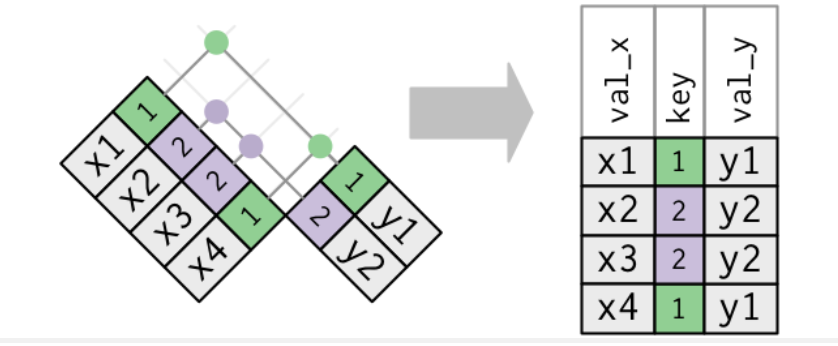
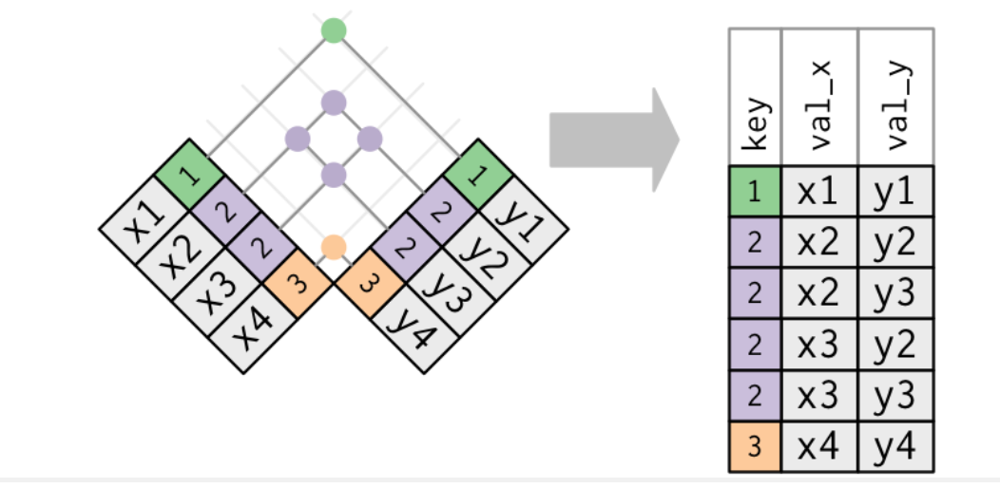
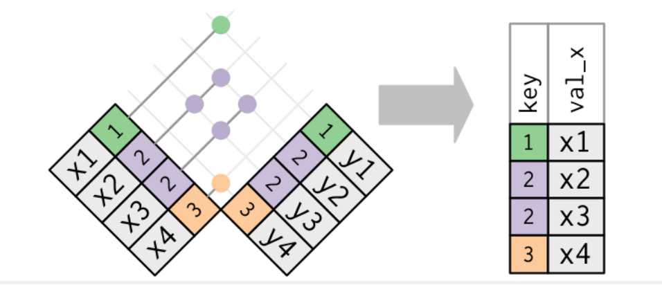

```{r}
library(tidyverse)
library(nycflights13)
library(ggplot2)
library(RcppRoll)

read_path = Sys.getenv('DATASETS')
write_path = paste(read_path, 'output', sep = '/')
working_dir = Sys.getenv('R_WORKING_DIR')

full_read_path <- function(filename) {
  paste(read_path, filename, sep = '/')
}

full_write_path <- function(filename) {
  paste(write_path, filename, sep = '/')
}

full_wd_path <- function(filename) {
  paste(working_dir, filename, sep = '/')
}
```
Verbs designed to work with relational data:

  * Mutating joins, which add new variables to one 
    data frame from matching observations in another.
  * Filtering joins, which filter observations from one 
    data frame based on whether or not they match 
    an observation in the other table.
  * Set operations, which treat observations as if they were 
    set elements.

## 13.2 nycflights13

  * airlines: identified by their abbreviated code
  * airports: identified by faa airport code
  * planes:   identified by tailnum
  * weather:  identified by origin, year, month, day, hour

```{r}
flights
airlines
airports
planes
weather
```


### 13.2.1 Exercises

1. Imagine you wanted to draw (approximately) the route each plane flies from its origin to its destination. What variables would you need? What tables would you need to combine?

For just the flight, we would need the flights table.
This would still not tell us about the latitude/longitude
or address of the position of the airport. We would need to use
some other table, not shown here for that.

2. I forgot to draw the relationship between weather and airports. What is the relationship and how should it appear in the diagram?

There is no relationship between weather and airports.

3. weather only contains information for the origin (NYC) airports. If it contained weather records for all airports in the USA, what additional relation would it define with flights?

The destination (dest) relation

4. We know that some days of the year are “special”, and fewer people than usual fly on them. How might you represent that data as a data frame? What would be the primary keys of that table? How would it connect to the existing tables?

From an article, I found these dead zones:

  * First two weeks of December
  * Jan. 7 through Jan. 31
  * Spring
  * Late August; there is usually another price drop in October

## 13.3 Keys

Keys uniquely identify an observation in a table.
Sometimes, a single variable can be a key for a table.
Sometimes, you need many variables that together forms a key.

A primary key uniquely identifies an observation in it's 
own table. ex. planes$tailnum
A foreign key uniquely identifies an observation in 
another table. ex. flights$tailnum

A variable can be a primary and a foreign key.

  * flights$origin is a foreign key
  * weather$origin is a part of the primary key for weather

To identify if a key is unique:
```{r}
planes %>%
  count(tailnum) %>%
  filter(n > 1)
```
Since there are no tailnums with the same value, this
gives us 0 rows. This means tailnum is a unique key for planes.

Sometimes, there are tables where you don't have unique
variables that would be a key:
```{r}
weather %>%
  count(year, month, day, hour, origin) %>%
  filter(n > 1)
```
```{r}
flights %>%
  count(year, month, day, hour, flight) %>%
  filter(n > 1)
```
If a table lacks a primary key, you can add one with mutate
and row_number functions. This is called a surrogate key.
It makes it easier to match observations if you've done
some filtering and want to check back with the original
data.

### 13.3.1 Exercises

1. Add a surrogate key to flights.

```{r}
flights %>%
  mutate(id = row_number()) %>%
  relocate(id)  # moves named column to left by default.
                # Use .before or .after to move before/after
                # other column.
```

2. Identify the keys in the following datasets

    Lahman::Batting,
    babynames::babynames
    nasaweather::atmos
    fueleconomy::vehicles
    ggplot2::diamonds

(You might need to install some packages and read some documentation.)

```{r}
library(Lahman)
library(babynames)
library(nasaweather)
library(fueleconomy)

Batting
babynames
atmos
vehicles
diamonds
```
```{r}
Batting %>%
  count(teamID, playerID, yearID, stint) %>%
  filter(n > 1)
babynames %>%
  count(n) %>%
  filter(n > 1)
atmos %>%
  count(lat, long, year, month) %>%
  filter(n > 1)
vehicles %>%
  count(id) %>%
  filter(n > 1)
print('There is no primary key for babynames/diamonds.
Even if we could select a set of variables for uniqueness,
there is no guarantee that an updated dataset
would have the same uniqueness of primary key')
```

3. Draw a diagram illustrating the connections between the Batting, People, and Salaries tables in the Lahman package. Draw another diagram that shows the relationship between People, Managers, AwardsManagers.

How would you characterise the relationship between the Batting, Pitching, and Fielding tables?

## 13.4 Mutating joins

Combines two table variables into one output table.
Since tables get wide, we will start off with narrower tables:
```{r}
(flights2 <- flights %>% 
  select(year:day, hour, origin, dest, tailnum, carrier))
```
Let's combine this table with airlines to get the full airline
name:
```{r}
flights2 %>%
  select(-origin, -dest) %>% # making table even more narrower
  left_join(airlines, by = 'carrier')
```

### 13.4.1 Understanding joins

```{r}
(x <- tribble(
  ~key, ~val_x,
     1, "x1",
     2, "x2",
     3, "x3"
))
(y <- tribble(
  ~key, ~val_y,
     1, "y1",
     2, "y2",
     4, "y3"
))
```

### 13.4.2 Inner join

The result of an inner join contains values where the
keys match.
```{r}
x %>%
  inner_join(y, by = 'key')
```

### 13.4.3 Outer joins

Three types of outer joins:

  * left join: keep all values of left table, append with
               variables from matching keys in right table
  * right_join: keep all values of right table, append with
               variables from matching keys in left table
  * full_join: keep all values from both tables
  
Out of the outer joins, the left join is usually used.
This is because you can add information from another table
to this table.

### 13.4.4 Duplicate keys

What happens when keys are not unique?

1. If only one table has duplicate keys:

```{r}
(x <- tribble(
  ~key, ~val_x,
     1, "x1",
     2, "x2",
     2, "x3",
     1, "x4"
))
(y <- tribble(
  ~key, ~val_y,
     1, "y1",
     2, "y2"
))

left_join(x, y, by = 'key')
```

2. Both tables have duplicate values

The output is a combinatation of all possible values
of the duplicate keys.


```{r}
(x <- tribble(
  ~key, ~val_x,
     1, "x1",
     2, "x2",
     2, "x3",
     3, "x4"
))
(y <- tribble(
  ~key, ~val_y,
     1, "y1",
     2, "y2",
     2, "y3",
     3, "y4"
))
left_join(x, y, by = "key")
```

### 13.4.5 Defining the key columns

key column specification can be:

  * by = NULL (default): all variables that are common in both tables
      are used as keys. This is called a natural join.
  * by = 'x': a character vector used to join. If there are other variables that
      are common across tables, the output will disambiguate them by adding a
      suffix to their names: "varname.x" and "varname.y"
  * by = c('a' = 'b'): matches key a in x with key b in y.
      The output will contain the variable named a.

by = NULL example:
```{r}
flights2 %>%
  left_join(weather)
```

by = 'x' example:
```{r}
flights2 %>%
  left_join(planes, by = 'tailnum')
```

by = c('a' == 'b') example:
```{r}
flights2 %>%
  left_join(airports, by = c('dest' = 'faa')) # or 'origin' == 'faa'
```

### 13.4.6 Exercises

1. Compute the average delay by destination, then join on the airports data frame so you can show the spatial distribution of delays. 
```{r}
flights %>%
  group_by(dest) %>%
  summarize(avg_arr_delay = mean(arr_delay, na.rm = TRUE)) %>%
  ggplot(aes(avg_arr_delay)) +
  geom_histogram(bins = 30)
```
Here’s an easy way to draw a map of the United States:
```{r}
airports %>%
  semi_join(flights, c("faa" = "dest")) %>%
  ggplot(aes(lon, lat)) +
    borders("state") +
    geom_point() +
    coord_quickmap()
```
Using the above code, and incorporating it to get the avg_arr_delay
per destination map:
```{r}
flights %>%
  select(dest, arr_delay) %>%
  left_join(airports, by = c('dest' = 'faa')) %>%
  group_by(dest) %>%
  summarize(avg_arr_delay = mean(arr_delay, na.rm = TRUE),
            lat = lat,
            lon = lon) %>%
  filter(!is.na(avg_arr_delay)) %>%
  distinct() %>%
  ggplot(aes(lon, lat, color = avg_arr_delay)) +
  borders('state') +
  geom_point()
```


2. Add the location of the origin and destination (i.e. the lat and lon) to flights.

```{r}
flights %>%
  left_join(airports, by = c('dest' = 'faa'))
```

3. Is there a relationship between the age of a plane and its delays?

```{r}
flights %>%
  left_join(planes, by = 'tailnum') %>%
  select(tailnum, year.x, year.y, arr_delay) %>%
  mutate(age = year.x - year.y) %>%
  filter(!is.na(age)) %>%
  ggplot(aes(age, arr_delay)) +
  geom_point(alpha = 1/10, na.rm = TRUE)
```

You can see that the delays seem like they're going down with age,
but the number of flights of the older planes are much smaller.
So let's try this by grouping by age and taking the median values.
```{r}
flights %>%
  left_join(planes, by = 'tailnum') %>%
  select(tailnum, year.x, year.y, arr_delay) %>%
  mutate(age = year.x - year.y) %>%
  filter(!is.na(age)) %>%
  ggplot(aes(age, arr_delay)) +
  geom_hex(aes(fill = stat(log(count))), # instead of plotting count,
                                         # plot the log(count).
           rm.na = TRUE)
```

From the above, it definitely looks like the arrival delays are less
for older planes. Maybe this is because older planes are used for
longer flights, and they can make up delays during those flights.

4. What weather conditions make it more likely to see a delay?

Since weather gives the weather at the 3 NY area airports,
we must look at just the departure delays.
```{r}
flights %>%
  separate(dep_time, 
           into = c('hour', 'hundredths_of_hr'),
           sep = 1,
           convert = TRUE) %>%
  left_join(weather, by = c('year', 'month', 'day', 'hour')) %>%
  ggplot(aes(visib, dep_delay)) +
  geom_hex(aes(fill = stat(log(count))), na.rm = TRUE)
  
flights %>%
  separate(dep_time, 
           into = c('hour', 'hundredths_of_hr'),
           sep = 1,
           convert = TRUE) %>%
  left_join(weather, by = c('year', 'month', 'day', 'hour')) %>%
  ggplot(aes(temp, dep_delay)) +
  geom_hex(aes(fill = stat(log(count))), na.rm = TRUE)
  
flights %>%
  separate(dep_time, 
           into = c('hour', 'hundredths_of_hr'),
           sep = 1,
           convert = TRUE) %>%
  left_join(weather, by = c('year', 'month', 'day', 'hour')) %>%
  ggplot(aes(pressure, dep_delay)) +
  geom_hex(aes(fill = stat(log(count))), na.rm = TRUE)

flights %>%
  separate(dep_time, 
           into = c('hour', 'hundredths_of_hr'),
           sep = 1,
           convert = TRUE) %>%
  left_join(weather, by = c('year', 'month', 'day', 'hour')) %>%
  ggplot(aes(wind_speed, dep_delay)) +
  geom_hex(aes(fill = stat(log(count))), na.rm = TRUE)
```

The counts look the same for each hex bin, but they're showing more delays
when visib is larger. This must mean visibility is poorer when visib
is larger - so the delays are larger.

For the temperature vs dep_delay, the result is not so clear. It seems
that there are more delays when the temperature is 75 vs 25, but that
could just be because there are more flights scheduled during summer
months since people are flying for vacation at that time.

For pressure vs dep_delay, it looks like the pressure from 1010
through 1030 has more delays than less or more pressure. Maybe a
hurricane was forming, and that delayed flights from landing in the
southeast, which delayed takeoff from New York airports.

5. What happened on June 13 2013? Display the spatial pattern of delays, and then use Google to cross-reference with the weather.

```{r}
flights %>%
  filter(year == 2013, month == 6, day == 13) %>%
  left_join(weather, by = c('year', 'month', 'day')) %>%
  ggplot(aes(visib, dep_delay)) +
  geom_hex(aes(fill = stat(log(count))), rm.na = TRUE)

flights %>%
  filter(year == 2013, month == 6, day == 13) %>%
  left_join(weather, by = c('year', 'month', 'day')) %>%
  ggplot(aes(temp, dep_delay)) +
  geom_hex(aes(fill = stat(log(count))), rm.na = TRUE)

flights %>%
  filter(year == 2013, month == 6, day == 13) %>%
  left_join(weather, by = c('year', 'month', 'day')) %>%
  ggplot(aes(pressure, dep_delay)) +
  geom_hex(aes(fill = stat(log(count))), rm.na = TRUE)
```

The delays are both small and large. The small delays are probably
due to flights going to places other than the southeast US.
Due to hurricanes, this area was impacted. Although we cannot tell
from the visibility, temperature, and pressure in New York, delays
in the SE would cause planes to be delayed in NY due to a chain reaction.
This was confirmed from googling the June 13 2013 date.

### 13.4.7 Other implementations

Translating to SQL:
inner_join(x, y, by = "z") 	SELECT * FROM x INNER JOIN y USING (z)
left_join(x, y, by = "z") 	SELECT * FROM x LEFT OUTER JOIN y USING (z)
right_join(x, y, by = "z") 	SELECT * FROM x RIGHT OUTER JOIN y USING (z)
full_join(x, y, by = "z") 	SELECT * FROM x FULL OUTER JOIN y USING (z)
inner_join(x, y, by = c("a" = "b")) SELECT * FROM x INNER JOIN y ON x.a = y.b

INNER and OUTER are optional and usually omitted.

SQL allows joins that don't require keys to be equal using the last
type of syntax above. For example, you could say
SELECT * FROM x INNER JOIN y ON x.a > y.b
These are called non-equijoins.
[Example of non-equijoin]('https://www.w3resource.com/sql/joins/perform-a-non-equi-join.php')

## Filtering joins

Filtering joins filter observations, not the variables.

semi_join(x, y): keep all observations from x that have a match in y.

  * useful for matching filtered summary tables back to the original rows.
  * never duplicate rows, like mutating joins

anti_join(x, y): drop all observations from x that have a match in y

  * useful for diagnosing join mismatches.
  
```{r}
(top_dest <- flights %>%
  count(dest, sort = TRUE) %>%
  head(10))

# To find flights that went to one of those destinations:
(flights %>%
  semi_join(top_dest)) # by default, it does a natural join
                       # matching all common variables in both tables.
```



Using anti_join and count, you can tell how many flights are missing
a tailnum.

```{r}
flights %>%
  anti_join(planes, by = 'tailnum') %>%
  count(tailnum, sort = TRUE)
```

### 13.5.1 Exercises

1. What does it mean for a flight to have a missing tailnum? What do the tail numbers that don’t have a matching record in planes have in common? (Hint: one variable explains ~90% of the problems.)

```{r}
(no_tailnum <- flights %>%
  anti_join(planes, by = 'tailnum') %>%
  filter(is.na(tailnum)))
```

Just looking at this table, it looks like there is no dep_time for most
flights. If a flight was grounded, even though it was scheduled,
there would be no tailnum. Let's confirm:
```{r}
no_tailnum %>%
  filter(is.na(dep_time)) %>%
  count()
```

So all the planes that are missing a tailnum are also missing a dep_time.

2. Filter flights to only show flights with planes that have flown at least 100 flights.
```{r}
(flights_gt_100 <- flights %>%
  group_by(tailnum) %>%
  mutate(n = n()) %>%
  filter(n >= 100) %>%
  slice_head())  # slice_head or slice_tail selects the first or last row

flights %>%
  semi_join(flights_gt_100, by = 'tailnum')
```

2. Combine fueleconomy::vehicles and fueleconomy::common to find only the records for the most common models.

```{r}
fueleconomy::vehicles # contains all records
fueleconomy::common   # contains only common vehicle models

fueleconomy::vehicles %>%
  semi_join(fueleconomy::common, by = c('make', 'model'))
```

4. Find the 48 hours (over the course of the whole year) that have the worst delays. Cross-reference it with the weather data. Can you see any patterns?

```{r}
(flights_hr_delay <- flights %>%
  separate(dep_time, c('hour', 'min_in_hundreds'), sep = 1) %>%
  mutate(hour = as.integer(hour)) %>%
  group_by(year, month, day, hour, origin) %>%
  summarise(prop_hr_delay = sum(dep_delay)/n()) %>%
  select(year, month, day, hour, prop_hr_delay, origin) %>%
  filter(!is.na(prop_hr_delay) | !is.na(day) | !is.na(hour)) %>%
  arrange(desc(prop_hr_delay)) %>%
  left_join(weather, by = c('year', 'month', 'day', 
                            'hour', 'origin')))
```
```{r}
scatter_plot <- function(data, x, name_x, y, name_y, alpha) {
  data %>%
    ggplot(mapping = aes(x = x, y = y)) +
    geom_point(alpha = alpha, na.rm = TRUE) +
    xlab(name_x) +
    ylab(name_y)
}

scatter_plot(flights_hr_delay, 
             flights_hr_delay$temp, 'temp',
             flights_hr_delay$prop_hr_delay, 'delay',
             1/5)
scatter_plot(flights_hr_delay, 
             flights_hr_delay$pressure, 'pressure',
             flights_hr_delay$prop_hr_delay, 'delay',
             1/5)
scatter_plot(flights_hr_delay, 
             flights_hr_delay$wind_speed, 'wind_speed',
             flights_hr_delay$prop_hr_delay, 'delay',
             1/5)
scatter_plot(flights_hr_delay, 
             flights_hr_delay$precip, 'precip',
             flights_hr_delay$prop_hr_delay, 'delay',
             1/5)
scatter_plot(flights_hr_delay, 
             flights_hr_delay$visib, 'visib',
             flights_hr_delay$prop_hr_delay, 'delay',
             1/5)
scatter_plot(flights_hr_delay, 
             flights_hr_delay$time_hour, 'time_hour',
             flights_hr_delay$prop_hr_delay, 'delay',
             1/5)

```

Patterns I see in the above plots:

  * As precip increases, delays decrease
  * As wind_speed increases, delays decrease

5. What does anti_join(flights, airports, by = c("dest" = "faa")) tell you? What does anti_join(airports, flights, by = c("faa" = "dest")) tell you?

anti_join(flights, airports, by = c("dest" = "faa")) returns observations
whose dest does not match faa values in airports. You can use this to
find out what faa values are missing from destinations in flights.
```{r}
anti_join(flights, airports, by = c("dest" = "faa"))
```
anti_join(airports, flights, by = c("faa" = "dest")) returns observations
whose faa does not match dest values in flights. You can use this to
find out what destinations are missing from faa values in airports.
```{r}
anti_join(airports, flights, by = c("faa" = "dest"))
```

6. You might expect that there’s an implicit relationship between plane and airline, because each plane is flown by a single airline. Confirm or reject this hypothesis using the tools you’ve learned above.

```{r}
flights %>%
  group_by(tailnum) %>%
  summarise(num_airlines_with_tailnum = 
              n_distinct(carrier)) %>%
  arrange(desc(num_airlines_with_tailnum))
```
So there are planes with the same tailnum that belonged to different
carriers. Maybe they were sold by one carrier and bought by another.

## 13.6 Join problems

Data does not come so clean. If it's dirty, your joins will not work.
To help with this problem:

  * Identify variables that form the primary key in each table based on
    your knowledge of the data. If you just look for uniqueness to find
    these primary keys, you may find them, but they may not be unique 
    in a later version of the data
  * A primary key variable must not have any missing values
  * Your foreign keys must match the primary key in other tables.
    It's common for keys not to match due to data entry errors.
    You can find such keys using anti_join.
    If you have missing keys, carefully consider if you should 
    drop rows that don't have a match (for outer joins). 
    Maybe you should use inner join instead.

You cannot count rows after a join to ensure there are no dropped rows.
If there are duplicate keys, the number of duplicated rows could 
equal the number of dropped rows.

## 13.7 Set operations

These are not usually used, but are sometimes helpful when breaking a
complex filter operation into multiple simpler pieces. These operations
are applied to every variable in the dataframe, and expect the same
variables in both dataframes.

  * intersect(x, y): return only observations in both x and y.
  * union(x, y):     return unique observations in x and y.
  * setdiff(x, y):   return observations in x, but not in y.

```{r}
(df1 <- tribble(
  ~x, ~y,
   1,  1,
   2,  1
))
(df2 <- tribble(
  ~x, ~y,
   1,  1,
   1,  2
))
```

```{r}
intersect(df1, df2)
union(df1, df2)
setdiff(df1, df2)
setdiff(df2, df1)
```

