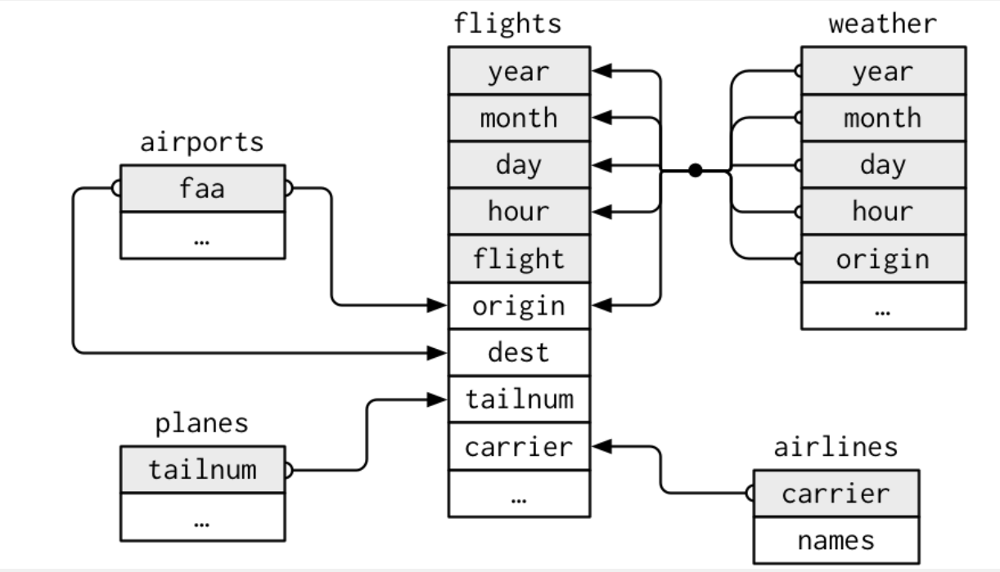

```{r}
library(tidyverse)
library(nycflights13)
library(ggplot2)

read_path = Sys.getenv('DATASETS')
write_path = paste(read_path, 'output', sep = '/')
working_dir = Sys.getenv('R_WORKING_DIR')

full_read_path <- function(filename) {
  paste(read_path, filename, sep = '/')
}

full_write_path <- function(filename) {
  paste(write_path, filename, sep = '/')
}

full_wd_path <- function(filename) {
  paste(working_dir, filename, sep = '/')
}
```
Verbs designed to work with relational data:

  * Mutating joins, which add new variables to one 
    data frame from matching observations in another.
  * Filtering joins, which filter observations from one 
    data frame based on whether or not they match 
    an observation in the other table.
  * Set operations, which treat observations as if they were 
    set elements.

## 13.2 nycflights13

  * airlines: identified by their abbreviated code
  * airports: identified by faa airport code
  * planes:   identified by tailnum
  * weather:  identified by origin, year, month, day, hour

```{r}
flights
airlines
airports
planes
weather
```



### 13.2.1 Exercises

1. Imagine you wanted to draw (approximately) the route each plane flies from its origin to its destination. What variables would you need? What tables would you need to combine?

For just the flight, we would need the flights table.
This would still not tell us about the latitude/longitude
or address of the position of the airport. We would need to use
some other table, not shown here for that.

2. I forgot to draw the relationship between weather and airports. What is the relationship and how should it appear in the diagram?

There is no relationship between weather and airports.

3. weather only contains information for the origin (NYC) airports. If it contained weather records for all airports in the USA, what additional relation would it define with flights?

The destination (dest) relation

4. We know that some days of the year are “special”, and fewer people than usual fly on them. How might you represent that data as a data frame? What would be the primary keys of that table? How would it connect to the existing tables?

From an article, I found these dead zones:

  * First two weeks of December
  * Jan. 7 through Jan. 31
  * Spring
  * Late August; there is usually another price drop in October

## 13.3 Keys

Keys uniquely identify an observation in a table.
Sometimes, a single variable can be a key for a table.
Sometimes, you need many variables that together forms a key.

A primary key uniquely identifies an observation in it's 
own table. ex. planes$tailnum
A foreign key uniquely identifies an observation in 
another table. ex. flights$tailnum

A variable can be a primary and a foreign key.

  * flights$origin is a foreign key
  * weather$origin is a part of the primary key for weather

To identify if a key is unique:
```{r}
planes %>%
  count(tailnum) %>%
  filter(n > 1)
```
Since there are no tailnums with the same value, this
gives us 0 rows. This means tailnum is a unique key for planes.

Sometimes, there are tables where you don't have unique
variables that would be a key:
```{r}
weather %>%
  count(year, month, day, hour, origin) %>%
  filter(n > 1)
```
```{r}
flights %>%
  count(year, month, day, hour, flight) %>%
  filter(n > 1)
```
If a table lacks a primary key, you can add one with mutate
and row_number functions. This is called a surrogate key.
It makes it easier to match observations if you've done
some filtering and want to check back with the original
data.

### 13.3.1 Exercises

1. Add a surrogate key to flights.

```{r}
flights %>%
  mutate(id = row_number()) %>%
  relocate(id)  # moves named column to left by default.
                # Use .before or .after to move before/after
                # other column.
```

2. Identify the keys in the following datasets

    Lahman::Batting,
    babynames::babynames
    nasaweather::atmos
    fueleconomy::vehicles
    ggplot2::diamonds

(You might need to install some packages and read some documentation.)

```{r}
library(Lahman)
library(babynames)
library(nasaweather)
library(fueleconomy)

Batting
babynames
atmos
vehicles
diamonds
```
```{r}
Batting %>%
  count(teamID, playerID, yearID, stint) %>%
  filter(n > 1)
babynames %>%
  count(n) %>%
  filter(n > 1)
atmos %>%
  count(lat, long, year, month) %>%
  filter(n > 1)
vehicles %>%
  count(id) %>%
  filter(n > 1)
print('There is no primary key for babynames/diamonds.
Even if we could select a set of variables for uniqueness,
there is no guarantee that an updated dataset
would have the same uniqueness of primary key')
```

3. Draw a diagram illustrating the connections between the Batting, People, and Salaries tables in the Lahman package. Draw another diagram that shows the relationship between People, Managers, AwardsManagers.

How would you characterise the relationship between the Batting, Pitching, and Fielding tables?

## 13.4 Mutating joins

