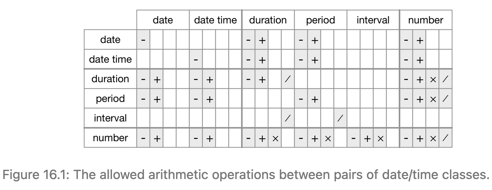

```{r}
library(tidyverse)
library(lubridate)
library(nycflights13)

read_path = Sys.getenv('DATASETS')
write_path = paste(read_path, 'output', sep = '/')
working_dir = Sys.getenv('R_WORKING_DIR')

full_read_path <- function(filename) {
  paste(read_path, filename, sep = '/')
}

full_write_path <- function(filename) {
  paste(write_path, filename, sep = '/')
}

full_wd_path <- function(filename) {
  paste(working_dir, filename, sep = '/')
}
```

Dates and times seem easy, but as you learn more they get more and
more complicated. Some of this is because:
  
  * many parts of the world use daylight savings time (DST), 
    so that some days have 23 hours, and others have 25.
  * some minutes have 61 seconds because every now and then leap seconds
    are added because the Earth’s rotation is gradually slowing down.

We will use the lubridate package to help with dates and datetimes.
R does not have a native class for storing times.
If you want to learn about times, look at the hms package.

## 16.2 Creating dates and times

Tibbles prints dates/times/datetimes differently:

  * dates: printed as <date>
  * times: printed as <time>
  * datetime: printed as <dttm> (actually, I see this printed as POSIXct).
    These are called POSIXct elsewhere in R.
  
Always use the simplest type possible. Datetimes are much more complicated
than dates, because of time zones.

Get the current date or datetime:
```{r}
today()
now()
```

You can create date/time from:

  * a string
  * individual date-time components
  * existing date/time object
  
### 16.2.1 From strings

To create dates from strings, give the ymd, mdy, dmy functions a string
with the correct order of components. These functions also take
unquoted numbers.
```{r}
ymd("2017-01-31")
mdy("January 31st, 2017")
dmy("31-Jan-2017")

ymd(20170131)
mdy(01312017)
dmy(31012017)
```

If the string cannot be parsed, an error will be returned.

To create a datetime, to the above function names, add an underscore and
one or more of "h", "m", "s":
```{r}
ymd_hms("2017-01-31 20:11:59")
mdy_hm("Jan 31 2017 08:01")
```

Force the creation of a datetime from a date by supplying a timezone:
```{r}
ymd("20170131", tz = "UTC")
```

### 16.2.2 Individual components

  * make_datetime(year, month, day, hour, min) to create datetime from
    individual components
  * make_date(year, month, day) to create date from individual components
```{r}
flights %>%
  select(year, month, day, hour, minute)
```
  
Notice that year, month, day are integers and hour, minute are doubles.
```{r}
flights %>%
  select(year, month, day, hour, minute) %>%
  mutate(departure = make_datetime(year, month, day, hour, minute))
```

Let's do the same for our other time columns where the times are
in an odd format:
```{r}
make_datetime_100 <- function(year, month, day, time) {
  make_datetime(year, month, day, time %/% 100, time %% 100)
}

flights_dt <- flights %>%
  filter(!is.na(dep_time), !is.na(arr_time)) %>%
  mutate(
    dep_time = make_datetime_100(year, month, day, dep_time),
    arr_time = make_datetime_100(year, month, day, arr_time),
    sched_dep_time = make_datetime_100(year, month, day, sched_dep_time),
    sched_arr_time = make_datetime_100(year, month, day, sched_arr_time)
  ) %>%
  select(origin, dest, ends_with("delay"), ends_with("time"))

flights_dt
```

Let's see the number of departures for the whole year.
Since datetimes have  a resolution of 1 second, binwidth is
given in seconds.

```{r}
flights_dt %>%
  ggplot(aes(dep_time)) +
  geom_freqpoly(binwidth = 86400) # 86400 seconds = 1 day
```
Or within a single day:
```{r}
flights_dt %>%
  filter(dep_time < ymd(20130102)) %>%
  ggplot(aes(dep_time)) +
  geom_freqpoly(binwidth = 600) # 600 seconds = 10 minutes
```

### 16.2.3 From other types

  * as_datetime: converts date to datetime.
    If the numeric offset from unix epoch (1970-01-01) is given
    in seconds, it can also convert it to datetime.
  * as_date:     converts datetime to date
    If the numeric offset from unix epoch (1970-01-01) is given
    in days, it can also convert it to date
  
```{r}
as_datetime(today())
as_date(now())
as_datetime(60 * 60 * 60)
as_date(365 * 10 + 2)
```
  

## 16.2.4 Exercises

1. What happens if you parse a string that contains invalid dates?
```{r}
ymd(c("2010-10-10", "bananas"))
```
You get an error message "failed to parse" along with an NA value
for the element that could not be parsed.

2. What does the tzone argument to today() do? Why is it important?

The tzone argument is a character specifying which time zone you would
like the current time in. It defaults to your computer's system timezone.
It is important because it provides a frame of reference for time
comparisons. You can compare times in the same time zones easily.
You can compare times in different time zones if you know the offset
of the time zones.

3. Use the appropriate lubridate function to parse each of the following dates:
```{r}
d1 <- "January 1, 2010"
mdy(d1)

d2 <- "2015-Mar-07"
ymd(d2)

d3 <- "06-Jun-2017"
dmy(d3)

d4 <- c("August 19 (2015)", "July 1 (2015)")
mdy(d4)

d5 <- "12/30/14" # Dec 30, 2014
mdy(d5)
```

## 16.3 Date-time components

Now that we can get datetime into R's datetime data structures,
let's see how we can access parts of that structure

### 16.3.1 Getting components

All of these functions can be used to extract parts of a datetime
structure. They all return a number by default:

  * year
  * month: set label = TRUE to return the abbreviated name of the month.
    Set label = TRUE & abbr = FALSE to return the full name of the month.
  * mday:  get the day of the month from structure
  * yday:  get the day of the year from structure
  * wday:  get the day of the week from structure.
    Set label = TRUE to return the abbreviated name of the weekday.
    Set label = TRUE & abbr = FALSE to return the full name of the weekday
  * hour
  * minute
  * second
  
```{r}
datetime <- ymd_hms("2016-07-08 12:34:56")
year(datetime)
month(datetime)
mday(datetime)
yday(datetime)
wday(datetime)
```
```{r}
month(datetime)
month(datetime, label = TRUE)
month(datetime, label = TRUE, abbr = FALSE)
```

```{r}
wday(datetime)
wday(datetime, label = TRUE)
wday(datetime, label = TRUE, abbr = FALSE)
```

We can use wday to see more flights depart during the week than on the
weekend:
```{r}
flights_dt %>%
  mutate(day = wday(dep_time, label = TRUE, abbr = FALSE)) %>%
  ggplot(aes(day)) +
  geom_bar()  # same as geom_histogram(stat = "count").
              # If you use geom_histogram() without stat = "count",
              # you will get an error: "statbin requires
              # continuous variable."
```

There's an interesting pattern if we look at average departure delay
for minute within the hour:
```{r}
flights_dt %>%
  mutate(minute = minute(dep_time)) %>%
  group_by(minute) %>%
  summarise(
    avg_delay = mean(dep_delay, na.rm = TRUE),
    n = n()) %>%
  ggplot(aes(minute, avg_delay)) +
  geom_line() # Here we use geom_line, because the avg_delay has
              # already been calculated. We use geom_freqpoly when
              # we want to count across a continuous variable,
              # In that case, geom_freqpoly will do the binning,
              # counting, and display all for us.
```
The average delay seems to be less from 20 to 30 minutes,
and from 50 to 60 minutes.

If we look at the scheduled departure time, there is no such pattern:
```{r}
sched_dep <- flights_dt %>%
  mutate(minute = minute(sched_dep_time)) %>%
  group_by(minute) %>%
  summarise(
    avg_delay = mean(dep_delay, na.rm = TRUE),
    n = n())

sched_dep %>%
  ggplot(aes(minute, avg_delay)) +
  geom_line()
```

So why is there such a pattern with actual departure times?
When humans are involved, there is a strong bias for flights leaving
at "nice" departure times. Always be aware of bias among humans.
```{r}
sched_dep %>%
  ggplot(aes(minute, n)) +
  geom_line()
```

### 16.3.2 Rounding

Instead of plotting individual components, we could round the date.
We can use these functions:

  * floor_date
  * round_date
  * ceiling_date
  
Each of these take a vector of dates, and the name of the unit to round
to. You can even round to a multiple of units (specified in English, like
"2 min", "2 mins", "2 minutes", "3 years"). Multiple unit rounding for
weeks is not supported.

Using these, let's plot the number of flights per week:

```{r}
flights_dt %>%
  count(week = floor_date(dep_time, "week")) %>%
  ggplot(aes(week, n)) +
  geom_line()
```
Computing the difference between a rounded and an unrounded date is
particularly useful.

### 16.3.3 Setting components

You can use accessor functions to set components of a datetime:
```{r}
(datetime <- ymd_hms("2016-07-08 23:34:56"))
year(datetime) <- 2020
month(datetime) <- 01
hour(datetime) <- hour(datetime) + 1 # Since beginning time is almost
                                     # midnight, adding 1 hour changes
                                     # day by 1 as well as the hour value.
datetime
```

  * update: to change the datetime. Values can roll over to the next level

```{r}
update(datetime, year = 2020, month = 2, mday = 2, hour = 2)
ymd("2015-02-01") %>%
  update(mday = 30)
ymd("2015-02-01") %>%
  update(hour = 400)
```

Here, we set the day to the first of the year. This way, all dep_times
are on the same day, and we can see the hourly variation for the year
Setting larger components of a date to constant is a powerful technique
that allows you to explore patterns in the smaller components:
```{r}
flights_dt %>%
  mutate(hour = update(dep_time, yday = 1)) %>%
  ggplot(aes(hour)) +
  geom_freqpoly(binwidth = 300)
```

### 16.3.4 Exercises

1. How does the distribution of flight times within a day change over the course of the year?

```{r}
flights_dt %>%
  mutate(hour = hour(dep_time)) %>%
  group_by(hour) %>%
  mutate(
    hour = hour,
    avg_air_time = sum(air_time, na.rm = TRUE) / n(),
    n = n()
  ) %>%
  ggplot(aes(hour, avg_air_time)) +
  geom_line()
```
I looks like shorter flights are scheduled more during the early morning
(from 2:30am - 4:30am).

2. Compare dep_time, sched_dep_time and dep_delay. Are they consistent? Explain your findings.

```{r}
flights_dt %>%
  select(sched_dep_time, dep_time, dep_delay) %>%
  mutate(
    consistent = minutes(dep_time - sched_dep_time) == dep_delay,
    delta = minutes(dep_time - sched_dep_time) - dep_delay
  ) 
```

The dep_delay is expected to be in minutes, but it looks like it is
given as the seconds portion of dep_time - sched_dep_time for many
observations. The only time it is consistent is when the flight leaves
on time, so dep_delay = 0 seconds.

3. Compare air_time with the duration between the departure and arrival. Explain your findings. (Hint: consider the location of the airport.)

```{r}
flights %>%
  inner_join(airports, by = c("dest" = "faa")) %>%
  select(year, month, day, dep_time, arr_time, air_time, tz) %>%
  mutate(
    dep_time = make_datetime_100(year, month, day, dep_time),
    arr_time = make_datetime_100(year, month, day, arr_time)
  ) %>%
  mutate(
    calc_arr_time = dep_time + minutes(air_time) + minutes(60 * (tz + 5))
  )
```
The calc_arr_time is always lesser than the arr_time. This is probably
because of the taxi time after landing to the gate.

4. How does the average delay (maybe departure?) time change over the course of a day? Should you use dep_time or sched_dep_time? Why?

You should use dep_time if you want to see the variation in the actual
departure time. This helps understand how delays are propagated.
If you want to understand how flights are scheduled over the course of
a day, then use sched_dep_time. This was done already above.

Let's try with sched_dep_time:
```{r}
flights_dt %>%
  mutate(hour = update(sched_dep_time, yday = 1)) %>%
  group_by(hour) %>%
  ggplot(aes(hour)) +
  geom_freqpoly(bins = 360) +
  scale_x_continuous(breaks = seq(make_datetime(2013, 01, 01, 0, 0, 0),
                                  make_datetime(2013, 01, 01, 23, 0, 0),
                                  by = '1 hour')) +
  coord_flip()
```

The chart is too dense, so let's look at just a portion of it:
```{r}
start_datetime <- make_datetime(2013, 01, 01, 9, 0, 0)
end_datetime <- make_datetime(2013, 01, 01, 12, 0, 0)

flights_dt %>%
  mutate(hour = update(sched_dep_time, yday = 1)) %>%
  filter(between(sched_dep_time, start_datetime, end_datetime)) %>%
  group_by(hour) %>%
  ggplot(aes(hour)) +
  geom_freqpoly(bins = 360) +
  scale_x_continuous(breaks = seq(start_datetime,
                                  end_datetime,
                                  by = '1 hour')) +
  coord_flip()
```

You can see that most of the scheduled departure times are at the
hourly or half-hourly marks.

5. On what day of the week should you leave if you want to minimise the chance of a delay?
```{r}
flights_dt %>%
  mutate(wday = wday(dep_time, label = TRUE, abbr = FALSE)) %>%
  select(wday, everything()) %>%
  group_by(wday) %>%
  summarize(
    avg_delay = mean(arr_delay, na.rm = TRUE)
  ) %>%
  ggplot(aes(wday, avg_delay)) +
  geom_bar(stat = "identity")
```

To minimize delay, leave on Saturday.

6. What makes the distribution of diamonds$carat and flights$sched_dep_time similar?

```{r}
diamonds %>%
  ggplot(aes(carat)) +
  geom_bar()

flights %>%
  ggplot(aes(sched_dep_time)) +
  geom_bar()
```
Their bar plots show a repeated pattern. There are more diamonds available
at integer and half integer carats. There are more flights scheduled on
the hour and on the half-hour.

7. Confirm my hypothesis that the early departures of flights in minutes 20-30 and 50-60 are caused by scheduled flights that leave early. Hint: create a binary variable that tells you whether or not a flight was delayed.

```{r}
flights_dt %>%
  filter((minute(dep_time) >= 20 & 
            minute(dep_time) <= 30) |
           (minute(dep_time) >= 50 & 
              minute(dep_time) <= 60)) %>%
  mutate(
    delayed = if_else(dep_delay > 0, TRUE, FALSE),
    dep_time = update(dep_time, yday = 1),
    early_dep_time = if_else(dep_time < sched_dep_time, TRUE, FALSE)
  ) %>%
  group_by((delayed == FALSE) & (early_dep_time == TRUE)) %>%
  summarize(n = n()) %>%
  mutate(prop = n / sum(n)) %>%
  select(prop, everything())
```
As you can see, 71% of the flights in the given time durations are
taking off early.

## 16.4 Time-spans

  * durations: represent an exact number of seconds.
  * periods:   represent human units like weeks and months.
  * intervals: represent a starting and ending point.

### 16.4.1 Durations

Durations represent an exact number of seconds.
```{r}
# How old is Hadley
(h_age <- today() - ymd(19791014))
```
The difftime class specifies duration in hours, minutes, seconds,
days or weeks.
This makes it difficult to work with. So lubridate provides durations
in seconds. When you print duration, it shows the seconds and also 
shows the largest human-readable sensible value 
(if the value < 1 week, show it in days, etc.). These conversions are
done based on the standard values of:
    
  * 1 minute = 60 seconds,
  * 1 hour = 60 minutes,
  * 1 day = 24 hours,
  * 1 week = 7 days,
  * 1 year = 365 days

```{r}
as.duration(h_age)
```
To construct durations:
```{r}
dseconds(15)
dminutes(10)
dhours(c(12, 24))
ddays(0:5)
dweeks(3)
dyears(1)
```

You can add and multiply durations.
```{r}
2 * dyears(1)
dyears(1) + dweeks(12) + dhours(15)
```

You can add/subtract durations to/from days:
```{r}
tomorrow <- today() + ddays(1)
last_year <- today() - dyears(1)
```
Since durations represent an exact number of seconds, you may get an
unexpected result. In this case, March 12 has 23 hours because of DST.
Also notice that the time zones have changed. This is why lubridate
provides periods which solves this issue.
```{r}
(one_pm <- ymd_hms("2016-03-12 13:00:00", tz = "America/New_York"))
one_pm + ddays(1)
```

### 16.4.2 Periods

Periods solve the issue that durations have with daylight savings time.
Periods don't work in seconds, but instead in days/months, etc. This makes
them intuitive to work with. Their resolution does extend to seconds.

Periods are different in that their value is realized only when they're
combined with a date/datetime. This makes them context-sensitive.
```{r}
one_pm
one_pm + days(1)
```
Because periods are context-sensitive, the addition of 1 day to one_pm
works as predicted. To create periods:
```{r}
seconds(15)
minutes(10)
hours(c(12, 24))
days(7)
months(1:6)
weeks(3)
years(1)
```

You can add and multiply periods:
```{r}
10 * (months(6) + days(1))
days(50) + hours(25) + minutes(2)
```
and add them to dates. Here we see how it handles leap years, and
daylight savings time:
```{r}
ymd("2016-01-01") + dyears(1)
ymd("2016-01-01") + years(1)

one_pm + ddays(1)
one_pm + days(1)
```

Some planes in the flights dataset seem to arrive at their destination
before they left New York city:
```{r}
flights_dt %>%
  filter(arr_time < dep_time)
```
These are overnight flights. We used the same date for departure and
arrival, but these flights arrived on the following day. We can fix this:
```{r}
flights_dt <- flights_dt %>%
  mutate(
    overnight = arr_time < dep_time,
    arr_time = arr_time + days(overnight * 1),
    sched_arr_time = sched_arr_time + days(overnight * 1)
  )

flights_dt %>%
  filter(overnight, arr_time < dep_time)
```

### 16.4.3 Intervals

What should years(1)/days(1) return? It depends which year it is.
For 2015 it should be 365, but for 2016 it should be 366.
```{r}
years(1) / days(1)
```
Since lubridate cannot tell which year, it averages based on leap year
occurring every 4 years. Take such proportional numbers as a warning,
that lubridate cannot tell you the exact answer yet.

To get a more accurate answer, use an interval. An interval has a starting
and ending points. This makes it easy to answer the question. The %--%
denotes the interval.
```{r}
next_year <- today() + years(1)
(today() %--% next_year) / ddays(1)
```

How many periods fall into an interval? Use integer division.
```{r}
(today() %--% next_year) %/% days(1)
```

### 16.4.4 Summary

Always pick the simplest data structure that solves your problem.

  * use duration if you only care about physical time
  * use period if you care about human time
  * use intervals if you want to figure out spans in human units



### 16.4.5 Exercises

1. Why is there months() but no dmonths()?

months gives the human-level month period. The actual value is determined
when it is applied to a date.

dmonths would have given the duration, but there are different durations
for months (29 days in Feb, 30 days in Nov, 31 days in Dec, etc.).
So it doesn't make sense to have a duration of a month

2. Explain days(overnight * 1) to someone who has just started learning R. How does it work?

overnight is a logical variable. A value of TRUE when multiplied by a
number (1) is converted into the number 1. If the logical value was FALSE,
it would be converted into the number 0.

3. Create a vector of dates giving the first day of every month in 2015. Create a vector of dates giving the first day of every month in the current year.
```{r}
make_start_of_month_dates <- function(year) {
  result <- Date(12)
  for (month in 1L : 12L) {
    result[month] = make_date(year = year, month = month, day = 1L)
  }
  result
}

(month_dates_2015 = make_start_of_month_dates(2015))

this_year = today() %>% str_extract("^(\\d{4})") %>% as.integer()
(month_dates_this_year = make_start_of_month_dates(this_year))
```

4. Write a function that given your birthday (as a date), returns how old you are in years.
```{r}
how_old <- function(birthday) {
  (today() - birthday) / ddays(365)
}

how_old(ymd("1966-01-09"))
```

5. Why can’t (today() %--% (today() + years(1))) / months(1) work?

I think it does work - even if it is a leap year
```{r}
((today() %--% (today() + years(1))) / months(1))

leap_date <- ymd("2016-01-01")
(leap_date %--% (leap_date + years(1))) / months(1)
```

