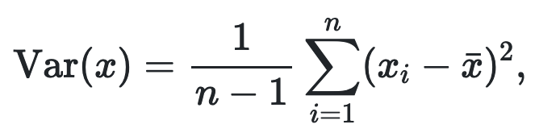
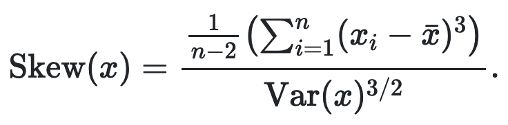

```{r}
library(dplyr)
```

Use functions to re-use parts of code from many different locations.

```{r}
df <- tibble::tibble(
  a = rnorm(100),
  b = rnorm(100),
  c = rnorm(100),
  d = rnorm(100)
)

# Instead of doing this for each variable:
# df$a <- (df$a - min(df$a, na.rm = TRUE)) / 
#  (max(df$a, na.rm = TRUE) - min(df$a, na.rm = TRUE))

# This function rescales values in x to the 0-1 range.
rescale01 <- function(x) {
  rng <- range(x, na.rm = TRUE, 
               finite = TRUE) # finite = TRUE tells function to ignore all
                              # non-finite elements.
  (x - rng[1]) / (rng[2] - rng[1])
}

# Test it
rescale01(c(0, 5, 10))
rescale01(c(1, 2, 3, NA, 5))
rescale01(c(1:10, Inf))  # If the range function call above did not have
                         # finite = TRUE, Inf would be converted to NaN
```

You can learn more about unit testing [here](http://r-pkgs.had.co.nz/tests.html)

Now that the rescale01 function works, use it to rescale the tibble:
```{r}
df$a <- rescale01(df$a)
df$b <- rescale01(df$b)
df$c <- rescale01(df$c)
df$d <- rescale01(df$d)
```

### 19.2.1 Exercises

1. Why is TRUE not a parameter to rescale01()? What would happen if x contained a single missing value, and na.rm was FALSE?

TRUE is a value that is fixed. It is a constant, not a variable.
Since it does not change, there is no reason to pass it in as a variable.
Let's see what happens if x contained a single missing value, and
na.rm = FALSE
```{r}
rescale01 <- function(x) {
  rng <- range(x, na.rm = FALSE, # If we set na.rm = FALSE, and x contained
               finite = TRUE)    # an NA value, range ignores it in
  (x - rng[1]) / (rng[2] - rng[1]) # it's calculation, and rescale01 
}                                # returns the same NA value back for that
                                 # element.
rescale01(c(1, 2, NA))
```

2. In the second variant of rescale01(), infinite values are left unchanged. Rewrite rescale01() so that -Inf is mapped to 0, and Inf is mapped to 1.

```{r}
rescale01_mapped <- function(x) {
  rng <- range(x, na.rm = TRUE, 
               finite = TRUE) # finite = TRUE tells function to ignore all
                              # non-finite elements.
  (x - rng[1]) / (rng[2] - rng[1])
}

rescale01 <- function(x) {
  case_when(
    x == -Inf ~ 0,
    x == Inf  ~ 1,
    TRUE      ~ rescale01_mapped(x)
  )
}

rescale01(c(0, 5, 10))
rescale01(c(1, 2, 3, NA, 5))
rescale01(c(1:10, -Inf, Inf))
```

3. Practice turning the following code snippets into functions. Think about what each function does. What would you call it? How many arguments does it need? Can you rewrite it to be more expressive or less duplicative?
```{r}
x <- c(1, 2, NA)
mean(is.na(x))
mean_no_na <- function(x) {
  mean(x, na.rm = TRUE)
}
mean_no_na(x)

x / sum(x, na.rm = TRUE)
prop <- function(x) {
  x / sum(x, na.rm = TRUE)
}
prop(x)

# The computed value here is the coefficient of variation.
# It tells you how much variation there is in the data.
sd(x, na.rm = TRUE) / mean(x, na.rm = TRUE)
coeff_of_variation <- function(x) {
  sd(x, na.rm = TRUE) / mean(x, na.rm = TRUE)
}
x
coeff_of_variation(x)
```

4. Write your own functions to compute the variance and skewness of a numeric vector. Variance is defined as:



Skewness is defined as:


```{r}
variance <- function(x) {
  # since our calculation requires at least one element,
  # return NA if x is empty
  len <- length(x)
  case_when(
    len <= 1 ~ Inf,
    TRUE     ~ sum((x - mean_no_na(x))^2, na.rm = TRUE) / 
                (len - 1)
  )
}

variance(c(1, 2, 31))

skew <- function(x) {
  # Since our calculation requires at least 2 elements,
  # return NA if x has less than 2
  len <- length(x)
  case_when(
    len <= 2 ~ Inf,
    TRUE     ~ sum((x - mean_no_na(x))^3, na.rm = TRUE) /
                ((len - 2) * ((variance(x))^1.5))
  )
}

skew(c(1, 2, 31))
```

5. Write both_na(), a function that takes two vectors of the same length and returns the number of positions that have an NA in both vectors.

```{r}
both_na <- function(x, y) {
  df <- tibble::tibble(x = x, y = y)
  df %>%
    filter(is.na(x), is.na(y)) %>%
    nrow()
}

both_na(c(1, NA, 2), c(2, NA, 3))
both_na(c(1, NA, NA), c(2, NA, 3))
both_na(c(1, NA, NA), c(2, NA, NA))
```

6. What do the following functions do? Why are they useful even though they are so short?

is_directory <- function(x) file.info(x)$isdir
This function returns TRUE if the file given is a directory, 
else it returns FALSE.

is_readable <- function(x) file.access(x, 4) == 0
This function checks the access rights to the file to see if the
user has read access.

They're useful because without them, the code will look cluttered.
Also, the name shows exactly what they're doing - this makes the
code very readable.

7. Read the complete lyrics to “Little Bunny Foo Foo”. There’s a lot of duplication in this song. Extend the initial piping example to recreate the complete song, and use functions to reduce the duplication.

I'm not going to do this. Sorry.

## 19.3 Functions are for humans and computers

  * Generally, function names should be verbs, arguments should be nouns.
    Sometimes, functions like mean, sd, etc. are nouns, but are preferred
    since it's better to say mean compared to compute_mean.
  * Select either snake_case or camelCase for your variable/function names
    Always keep using the same case throughout your code.
    This makes it easier to read.
  * Use a prefix if you have a family of functions. This way, when you
    type in that prefix, RStudio will tell you the possible completions.
  * Explain the "why" of your code with comments.
    The "how" and "what" should be self-explanatory by reading the code.
    
### 19.3.1 Exercises

1. Read the source code for each of the following three functions, puzzle out what they do, and then brainstorm better names.
```{r}
# Returns true if the prefix is actually the string prefix
f1 <- function(string, prefix) {
  substr(string, 1, nchar(prefix)) == prefix
}
f1("Christmas carol", "Christmas")

# Removes the rightmost value in the vector before returning it
f2 <- function(x) {
  if (length(x) <= 1) return(NULL)
  x[-length(x)]  # A negative index implies remove that value and
                 # return the vector.
}
f2(c("this", "is", "a", "test"))

# Repeats the x vector until it equals the length of y
f3 <- function(x, y) {
  rep(y, length.out = length(x))
}
f3(c("what", "is", "this"), c("something", "nothing"))
```

3. Compare and contrast rnorm() and MASS::mvrnorm(). How could you make them more consistent?

rnorm returns a vector with number of samples specified by n. It uses
the given mean/sd or 0 mean 1 sd.

MASS:mvrnorm returns a vector with the number of samples specified by n.
But, it uses a number of random variables to generate it's samples.
Each variable's mean is given with the covariance matrix. This makes it
a multivariate normal distribution.

MASS:mvrnorm with one mean and 1 variance == rnorm.
So you could just use MASS::mvrnorm

4. Make a case for why norm_r(), norm_d() etc would be better than rnorm(), dnorm(). Make a case for the opposite.

norm_r and norm_d would be better than rnorm and dnorm because when you
start typing norm, RStudio will give you a list of functions that have
norm as the prefix. This makes it easier to select the right one.

rnorm and dnorm is better because rnorm stands for random normal
distribution, and dnorm for density normal distribution, which are
commonly used. Also, rnorm and dnorm are easier to remember.
norm_r and norm_d seem kludgey.

## 19.4 Conditional execution

  * To get help of if, you have to surround it with backticks: ?`if`
  
```{r}
has_name <- function(x) {
  nms <- names(x) # This will give c('a', 'b') for x <- c(a = x, b = y)
  if (is.null(nms)) { # This is vectorized. It looks at each nms value.
    # rep(FALSE, length(x)) # I think this is wrong. Value returned
                            # should be only for the current index.
    FALSE
  } else {
    !is.na(nms) & nms != ""
  }
}

has_name(c(a = 'x', 'y', c = 'z'))
```

### 19.4.1 Conditions

  * || and && operators are short-circuiting. When or sees the first TRUE,
    it returns TRUE. When && sees the first FALSE, it returns FALSE.
  * You should never use | and & in an if. They're vectorized, and apply
    to multiple values.
  * With logical vectors, you can use any() or all() to collapse them
    to a single value
  * be careful with ==. It is vectorized, so you will get multiple outputs
  * You can use identical function. It is not vectorized, and requires
    the same types. identical(0L, 0) will return FALSE.
  * You also need to be careful of floating point numbers.
    sqrt(2)^2 - 2 will give a small fractional number. So you cannot
    compare floating point numbers to integers. Instead, use
    dplyr::near() for such comparisons.
  * To compare with NA, use is.na function

```{r error=FALSE}
if (c(TRUE, FALSE)) {}
# if (NA) {}  # This returns error "missing value where TRUE/FALSE needed"
```

### 19.4.2 Multiple conditions

