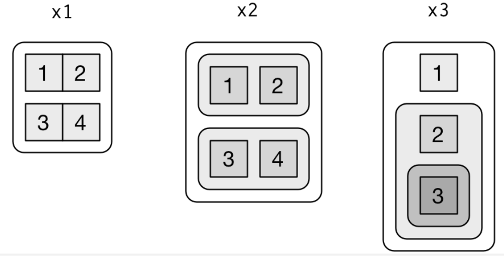
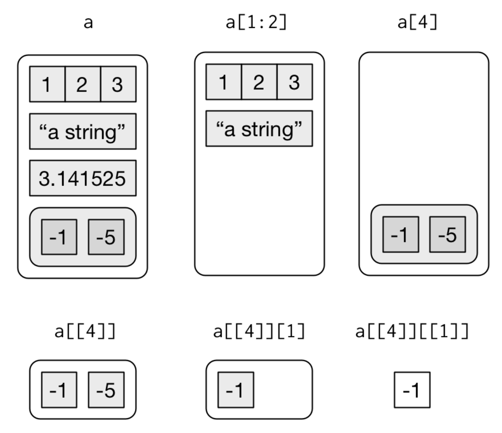

```{css, echo = FALSE}
body {
  background-color: black;
  filter: invert(1);
}
table {
  empty-cells: hide;
}
```

```{r}
library(tidyverse)
```
## 20.2 Vector basics

Two types of vectors:

  * atomic: contain homogeneous types.
    ex. logical, integer, double, character, complex, raw.
    Integer and double vectors are together known as 
    numeric vectors.
  * lists: contain heterogeneous types.
    Also called as recursive vectors, since lists can contain lists.
    
NULL represents abscense of a vector.
NA represents abscence of a value.

Every vector has 2 properties:

  * type: typeof returns the type of the value in the vector.
    This is why c("this", "that") is called a character vector,
    cause the values are characters.
  * length: length returns the length
  
Vectors can also contain additional metadata. This helps in
creating augmented vectors. There are 3 types:

  * Factors are built on top of integer vectors
  * Dates and date-times are built on top of numeric vectors
  * Data frames and tibbles are built on top of lists
  
## 20.3 Important types of atomic vectors

  * Logical:
    Only values are TRUE, FALSE, NA. They're constructed by:
    
    + comparison operators: 1:10 % 3 == 0
    + directly: c(TRUE, FALSE, NA)
    
  * Integer:
    By default, specifying a number causes it to become a double.
    Use the L suffix on the number to make it an integer.
    
    + 10 becomes the double value 10
    + 10L becomes the integer value 10
    
    Integers have one special value: NA
    
  * Double:
    Doubles are approximations. To compare two doubles, use
    dplyr::near. ex:
```{r}
    x <- sqrt(2) ^ 2
    x
    x - 2
```
    Doubles have 4 special values. This is how to detect each:
    
    + NA:   is.na
    + NaN:  is.nan detects both NA and NaN
    +/-Inf: is.infinite. +/-Inf applies to doubles only, 
            not to integers
    
    To detect a normal number: is.finite (not infinite or missing).
    
```{r}
    c(-1, 0, 1) / 0
```
    
  * Character:
    Character vectors are the most complicated since each value
    can be a string of any length.
    R uses a global string pool - each string in R is only stored
    once, and referenced multiple times.
```{r}
x <- "this is a long string"
pryr::object_size(x)

y <- rep(x, 1000)
pryr::object_size(y)
```

The output size of the 1000-length repeated string is now
136 B + (1000 pointers) * (8 B / pointer) ~ 8.13 KB. It's not
136 * 1000 = 136 KB.

### 20.3.4 Missing values

Each type of atomic vector has it's own missing value:

  * NA: logical, but will be converted using coercion to one of
        the other NA_... types. So you can just use NA everywhere.
        Some functions are strict, so you may need to use one of
        the NA_... types to pass to it.
  * NA_integer_
  * NA_real_
  * NA_character_

### 20.3.5 Exercises

1. Describe the difference between is.finite(x) and !is.infinite(x).

is.finite:    Returns TRUE if x is not infinite and not missing.
              Returns FALSE otherwise.
is.infinite:  Returns TRUE if x is either -Inf or Inf.
              Returns FALSE otherwise.

2. Read the source code for dplyr::near() (Hint: to see the source code, drop the ()). How does it work?

```{r}
dplyr::near
print(paste0("Tolerance: ", .Machine$double.eps^0.5, sep = ""))
```
If the absolute value of the difference between two numbers
is less than the tolerance, then return TRUE, else FALSE.

3. A logical vector can take 3 possible values. How many possible values can an integer vector take? How many possible values can a double take? Use google to do some research.

An integer vector can take an infinite number of values, because
a vector can have any length

You can find all of this information using ?.Machine:

  * An integer can take 2^31-1 values (including negative values).
  * A double has 53 bits of significand and 11 bits of exponent.
    This adds up to 64 bits, so a double can take 2^64 - 1 values.

4. Brainstorm at least four functions that allow you to convert a double to an integer. How do they differ? Be precise.

  * as.integer: truncates doubles if they fit within 32 bits.
                If not, returns NA.
  * floor:      returns a truncated double.
                Wrap it in as.integer to get an integer.
  * ceiling:    returns a double.
                Wrap it in as.integer to get an integer.
  * trunc:      truncates doubles, returns a double.
                Wrap it in as.integer to get an integer.
```{r}
x <- 1 # If you don't include the L suffix, this is a double
typeof(x)
typeof(as.integer(x))
typeof(floor(x))
typeof(ceiling(x))
typeof(trunc(x))
```

5. What functions from the readr package allow you to turn a string into logical, integer, and double vector?

  * logical: readr::parse_logical
  * integer: readr::parse_integer
  * double:  readr::parse_double

## 20.4 Using atomic vectors

### 20.4.1 Coercion

How to convert from one type to another, 
and when that happens automatically.
  
  + Explicit conversion using as.logical(), as.integer(), 
    as.double(), or as.character().
    Consider changing the code upstream instead of
    explicit conversion.
  + Implicit conversion occurs when you use a vector in a context
    that expects a certain type of vector.
    Most important type of this is using a logical vector in a
    numeric context. TRUE becomes 1, FALSE becomes 0.
    - sum(logical vector) = sum(TRUE values)
    - mean(logical vector) = proportion of TRUE values.
```{r}
x <- sample(20, 100, replace = TRUE) # sample 100 values from 1:20,
                                     # with replacement
y <- x > 10
sum(y)  # How many values were > 10
mean(y) # Proportion of values > 10
```

Sometimes, integer to logical conversion is used like this.
Here 0 is converted to FALSE, anything else to TRUE:
if (length(x)) { do something }. Instead, do this:
if (length(x) > 0) { do something }. This is more explicit.

When you use c to create a vector with multiple types,
the resulting vector uses the most complex type given to it.

### 20.4.2 Test functions

How to tell if an object is a specific type of vector?
The purrr functions is_* provides consistent results compared to
the base R functions of is.*.

Function | lgl | int | double | chr | list
-------- | --- | --- | ------ | --- | ----
is_logical | x |     |        |     |
is_integer |   |  x  |        |     |
is_double  |   |     |    x   |     |
is_numeric |   |  x  |    x   |     |
is_character|  |     |        |  x  |
is_atomic |  x |  x  |    x   |  x  |
is_list   |    |     |        |     |  x
is_vector |  x |  x  |    x   |  x  |  x

### 20.4.3 Scalars and recycling rules

What happens when you work with vectors of different lengths.
The smaller length vectors are coerced to the larger length,
before the operation between them takes place. This is called
recycling. Since such clever code can conceal hidden problems,
tidyverse does not allow anything execpt a scalar to recycle.
Any vector will need to be recycled using the rep function.
```{r}
1:10 + 1:2
# Produces error: 
# Column `y`. ℹ Only values of size one are recycled.
# tibble(x = 1:4, y = 1:2)
tibble(x = 1:4, y = rep(1:2, 2))
tibble(x = 1:4, y = rep(1:2, each = 2))
```

R does not have scalars. A value of 1 is actually a double inside
a vector of length 1. Most functions in R are vectorized.
That's why these computations work:
```{r}
sample(10) + 100
runif(10) > 0.5
```

### 20.4.4 Naming vectors

Any element of a vector can be named:
```{r}
c(x = 1, y = 2, z = 4)
```
Or, after the fact with purrr::set_names:
```{r}
set_names(1:3, c("a", "b", "c"))
```
Named vectors are most useful for subsetting.

### 20.4.5 Subsetting

So far, we have used dplyr::filter function for subsetting tibbles.
For vectors, we use the [ operator.

You can subset a vector with:

  * an integer vector of:
    + all positive values: extract values at those positions.
      By repeating position values inside the vector, you can
      get a longer vector
    + all negative values: drop values at those positions.
    + the zero value: returns no value. This helps create
      unusual data structures to test your functions with.

```{r}
x <- c("one", "two", "three", "four", "five")
x[c(3, 2, 5)]
x[c(1, 2, 2, 3, 3, 1, 1, 5, 5)]
x[c(-1, -3, -5)]

# Produces:
# Error in x[c(-1, 1)] : only 0's may be mixed with 
# negative subscripts
# x[c(-1, 1)]
x[0]
```

  * Subsetting with a logical vector keeps all values where the
    positional value is TRUE
```{r}
x <- c(10, 3, NA, 5, 8, 1, NA)
x[!is.na(x)]
x[x %% 2 == 0] # Gets all even or missing values of x
```
    
  * A named vector can be subset with a character vector
```{r}
x <- c(abc = 1, def = 2, xyz = 5)
x[c("xyz", "def")]
```
  * The simplest form of subsetting is nothing, x[], which
    returns the entire x vector. This is useful for 2d matrices:
    + x[1, ] returns the first row with all columns
    + x[, -1] returns all rows, and all columns except the first.
    
An important variation of [ function is the [[ function.
It only ever extracts a single element, and always drops names.
The distinction between [ and [[ is important for lists.

### 20.4.6 Exercises

1. What does mean(is.na(x)) tell you about a vector x? What about sum(!is.finite(x))?

mean(is.na(x)): Proportion of NAs in x
sum(!is.finite(x)): Number of Inf, -Inf or NA in x

2. Carefully read the documentation of is.vector(). What does it actually test for? Why does is.atomic() not agree with the definition of atomic vectors above?

is.vector returns TRUE if the first argument is a type of vector
of the given mode. Modes are:

||||||
|--|--|--|--|--|
| logical | integer | double | complex | character |
| raw     | list    | NULL   | closure (function) | special |
| builtin | environment | S4 | symbol | pairlist  |
| promise | language   | char     |  ...   | any |
| expression | externalptr | bytecode  |  weakref  |           |

Note: Factors are not vectors.

You can also use mode = "any" to check if the vector is of any
of these modes.

is.atomic returns TRUE only for a small subset of the above types.
This is why is.vector does not agree with is.atomic for
all vector types.

3. Compare and contrast setNames() with purrr::set_names().

setNames takes in an object and a vector of names of the same
length as the object. It returns an object where the names for
each element of the vector are set.

purrr::set_names takes in an object and:

  * a vector of names of the same length as the object. It returns
    a vector with each element named
  * a formula to convert existing names to new names
  * a function to call to convert existing names to new names.
    Any values after the function call are passed to the function
    using the ... variable.
    
4. Create functions that take a vector as input and returns:

  1. The last value. Should you use [ or [[?
  
You should use [[ since it only extracts a single element.
[ is used to extract a vector of the selected elements.

```{r}
last_value <- function(x) {
  x[[length(x)]]
}

x <- c("this", "is", "a", "word")
last_value(x)
```
  
  2. The elements at even numbered positions.
```{r}
even_pos_values <- function(x) {
  even_pos <- seq(2, length(x), by = 2)
  x[even_pos]
}

even_pos_values(x)
```
  
  3. Every element except the last value.
```{r}
all_but_last <- function(x) {
  x[-length(x)]
}

all_but_last(x)
```
  
  4. Only even numbers (and no missing values).
```{r}
even_pos_no_missing_values <- function(x) {
  y <- even_pos_values(x)
  y[!is.na(y)]
}

x <- c("this", NA, NA, "is")
even_pos_no_missing_values(x)
```


5. Why is x[-which(x > 0)] not the same as x[x <= 0]?

These two expressions are the same. Consider:

x > 0: returns a logical vector with TRUE when x > 0, else FALSE.
which: returns indices of the TRUE values
-: returns all values except those specified

x[-which(x > 0)]: returns values where x <= 0
Example:
```{r}
x <- c(-2, 5, 8, 9, 20, -1)
x[-which(x > 0)]
typeof(x[-which(x > 0)])
x[x <= 0]
typeof(x[x <= 0])
```

6. What happens when you subset with a positive integer that’s bigger than the length of the vector? What happens when you subset with a name that doesn’t exist?

```{r}
x <- c(1, 2, 3, 4, 5, 6)
x[7]

x <- c(a = 1, b = 2, c = 3)
x["a"]
x[c("a")]
x["d"]
x[c("d")]
```
A value of NA is returned when you:

  * subset with an index larger than the length of the vector.
  * subset with a name that doesn't exist

## 20.5 Recursive vectors (lists)

  * Lists can contain other lists. They're good for 
    representing a hierarchy. Create a list with the list function.
  * Lists can contain a mix of objects of differing types
  * Lists can also contain other lists.
  
```{r}
x <- list(1, 2, 3)
x
str(x) # Gives the structure of a list. Very good function to use
       # with lists.
```

```{r}
x_named <- list(a = 1, b = 2, c = 3)
str(x_named)
```

```{r}
y <- list("a", 1L, 1.5, TRUE)
str(y)
```

```{r}
z <- list(list(1, 2), list(3, 4))
str(z)
z <- list(1:2, 3:4)
str(z)
```

## 20.5.1 Visualizing lists



There are three principles:

  1. Lists have rounded corners. Atomic vectors have 
     square corners.
  2. Children are drawn inside their parent, and have a 
     slightly darker background to make it easier to see
     the hierarchy.
  3. The orientation of the children (i.e. rows or columns) 
     isn’t important, so I’ll pick a row or column orientation 
     to either save space or illustrate an important property 
     in the example.

### 20.5.2 Subsetting

Three ways of subsetting a list:

  * [ extracts a sub-list and wraps it in another list which 
    is returned.
  * [[ extracts a component of the list and returns it.
    You can only put 1 index/name between the [[]].
    If you put in a name, it has to be quoted.
  * $ can extract named list values. It's similar to [[,
    except, you don't need to quote the name



```{r}
a <- list(a = 1:3, b = "a string", c = pi, d = list(-1, -5))
str(a[1])      # returns list(a = c(1L, 2L, 3L))
str(a[1:2])    # returns list(a = c(1L, 2L, 3L), b = "a string")
str(a[4])      # returns list(d = list(-1, -5))
```

```{r}
str(a[[1]])      # returns c(1L, 2L, 3L)
str(a[[4]])      # returns list(-1, -5)
str(a[[4]][1])   # returns list(-1)
str(a[[4]][[1]]) # returns -1
```

### 20.5.4 Exercises

1. Draw the following lists as nested sets:

  list(a, b, list(c, d), list(e, f))
  a, b, [c, d], [e, f]
  
  list(list(list(list(list(list(a))))))
  [[[[[[a]]]]]]

2. What happens if you subset a tibble as if you’re subsetting a list? What are the key differences between a list and a tibble?

[] returns a tibble
[[]] returns the value, as with a list
```{r}
x <- tibble(a = 1:3, b = c("p", "q", "r"), c = 4:6)
x

x[2]    # returns a tibble with one column
x[2:3]  # returns a tibble with 2 columns
x[[1]]    # returns a list
x[[1]][1] # returns a list
x[[2]][1] # returns a list
x[[1]][[1]] # returns a value
x[[2]][[1]] # returns a value
```

## 20.6 Attributes

  * attributes are named list of vectors attached to a vector
  * attr function gets/sets individual attributes
  * attributes function shows all attributes

```{r}
x <- 1:10
attr(x, "greeting")

attr(x, "greeting") <- "Hi!"
attr(x, "farewell") <- "Bye!"
attributes(x)
```

Three important attributes:

  * names: used to name elements of a vector
  * dims: used to specify dimensions of a vector.
          This makes a matrix work like an array.
          This won't be covered in this book.
  * class: used to implement the S3 object oriented system.
           class controls how generic functions work.
           
If you type in a function name, and it has a call to UseMethod,
this means:

  * the function you typed in is a generic function
  * it will call a specific method based on the class of the 
    first argument

```{r}
as.Date
```

You can list all methods for a generic (or class?) using methods:
```{r}
methods("as.Date")
```
If x is a character vector, as.Date will call as.Date.character.
If x is a factor, as.Date will call as.Date.factor.
You can see the specific implementation of a method
with getS3method:
```{r}
getS3method("as.Date", "default")
```
```{r}
getS3method("as.Date", "numeric")
```
print, [, [[, and $ are important S3 generic functions.

## 20.7 Augmented vectors

When you add attributes to vectors, we call those 
augmented vectors. Class is one attribute that they have
in common. The augmented vectors we will look at are:

  * Factors
  * Dates
  * Date-times
  * Tibbles

### 20.7.1 Factors

Factors represent categorical data that take a fixed set of
possible values. They're built on top of integers, and have
a levels attribute.
```{r}
x <- factor(c("ab", "cd", "ab"), 
            levels = c("ab", "cd", "ef"))
typeof(x)
attributes(x)
```

### 20.7.2 Dates and date-times

Dates are numeric vectors that represent dates since 1 Jan 1970.
```{r}
x <- as.Date("1971-01-01")
unclass(x)
typeof(x)
attributes(x)
```

Date-times are numeric vectors with class POSIXct that represent 
time since 1 Jan 1970.
```{r}
x <- lubridate::ymd_hm("1970-01-01 01:00")
unclass(x)
typeof(x)
attributes(x)
```

The tzone only controls how the time is printed, not what the
absolute time refers to. When you change the tzone attribute,
the printed time will change accordingly.
```{r}
x
attr(x, "tzone") <- "US/Pacific"
x
attr(x, "tzone") <- "US/Eastern"
x
```
Another date-time type is POSIXlt. These are built on top of
named lists:
```{r}
y <- as.POSIXlt(x)
typeof(y)
attributes(y)
```
POSIXlt's are rare in the tidyverse. You don't need them.
Lubridate gives you helpers to do this instead. If you see a
POSIXlt, convert it to a regular date-time using
lubridate::as_date_time function.

### 20.7.3 Tibbles

Tibbles are augmented lists with these attributes:

  * tbl_df
  * tbl
  * data.frame
  * names (column)
  * row.names

Tibbles require each vector in it to have the same length.
All functions that work with tibbles enforce this requirement.
```{r}
tb <- tibble(x = 1:5, y = 5:1)
typeof(tb)
attributes(tb)
```

Traditional dataframes have the same structure, but the class is
different. The class of tibble includes the "data.frame", which
means they inherit the regular data frame behavior by default.
```{r}
df <- data.frame(x = 1:5, y = 5:1)
typeof(df)
attributes(df)
```

### 20.7.4 Exercises

1. What does hms::hms(3600) return? How does it print? What primitive type is the augmented vector built on top of? What attributes does it use?

The augmented vector is built on top of a double that stores the
seconds since 1 Jan 1970. The other answers are here:
```{r}
x <- hms::hms(3600)
x
typeof(x)
attributes(x)
```

2. Try and make a tibble that has columns with different lengths. What happens?

```{r}
# tb <- tibble(x = 1:5, y = 1:3)
# Returns:
# Error: Tibble columns must have compatible sizes.
tb2 <- tibble(x = 1:5, y = 1) # You can use recycling on single
                              # value here to get equal number
                              # of rows.
tb2
```

3. Based on the definition above, is it ok to have a list as a column of a tibble?

As long as the lists are of the same length, it should work:
```{r}
x <- tibble(x = list(1, 2, 3), y = list('a', 'b', 'c'))
x
x[[1]]
x[[2]]
```

