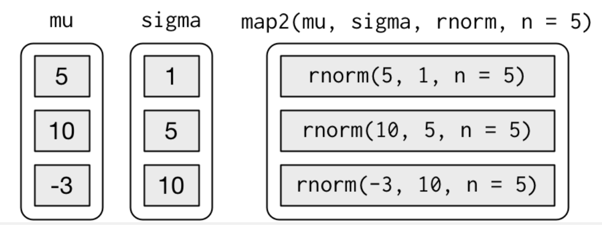

```{css, echo = FALSE}
body {
  background-color: black;
  filter: invert(1);
}
table {
  empty-cells: hide;
}
```
```{r results='hide'}
library(tidyverse)
```

Benefits of reducing code duplication using functions:

  * Easier to see intent of your code by the function name
  * Easier to respond to changes in requirements
  * Less bugs since less lines of code
  
Iteration is also a tool to reduce duplication.
Imperative programming uses for loops etc. for iteration.
But loops are verbose.
Functional programming extracts out the loop pattern into a function.

## 21.2 For loops

```{r}
df <- tibble(
  a = rnorm(10),
  b = rnorm(10),
  c = rnorm(10),
  d = rnorm(10)
)

# You must allocate space before the loop for the output.
# If you grow the output using c() in the loop, 
# the loop will be slow
output <- vector("double", ncol(df))

# You should use seq_along if possible. It does the right thing
# if the length of the vector is 0.
# If you use 1:length(vector), then the loop will be evaluated
# for the index 1, and you will get an error.
for (i in seq_along(df)) {
  output[[i]] <- median(df[[i]])
}
output
```

### 21.2.1 Exercises

1. Write for loops to:

  1. Compute the mean of every column in mtcars.
  2. Determine the type of each column in nycflights13::flights.
  3. Compute the number of unique values in each column of iris.
  4. Generate 10 random normals from distributions with 
     means of -10, 0, 10, and 100.

Think about the output, sequence, and body before you start writing the loop.

```{r}
output <- vector("double", ncol(mtcars))
for (i in seq_along(mtcars)) {
  output[[i]] <- mean(mtcars[[i]])
}
output

output <- vector("character", ncol(nycflights13::flights))
for (i in seq_along(nycflights13::flights)) {
  output[[i]] <- typeof(nycflights13::flights[[i]])
}
output

output <- vector("integer", ncol(iris))
for (i in seq_along(iris)) {
  output[[i]] <- n_distinct(iris[[i]])
}
output

input <- c(-10, 0, 10, 100)

output <- matrix(nrow = 4, ncol = 10)
for (i in seq_along(input)) {
  output[i, ] <- rnorm(10, mean = input[[i]])
}
output
```

2. Eliminate the for loop in each of the following examples by taking advantage of an existing function that works with vectors:
```{r}
# Instead of ...
out <- ""
for (x in letters) {
  out <- stringr::str_c(out, x)
}
out
# ... use this
stringr::str_c(letters, collapse = "")

# Instead of ...
x <- sample(100)
sd <- 0
for (i in seq_along(x)) {
  sd <- sd + (x[i] - mean(x)) ^ 2
}
sd <- sqrt(sd / (length(x) - 1))
sd

# ... use this
sd(x)

# Instead of ...
x <- runif(100)
out <- vector("numeric", length(x))
out[1] <- x[1]
for (i in 2:length(x)) {
  out[i] <- out[i - 1] + x[i]
}
out

# ... use this
cumsum(x)
```

3. Combine your function writing and for loop skills:

  1. Write a for loop that prints() the lyrics to the children’s song “Alice the camel”.
  2. Convert the nursery rhyme “ten in the bed” to a function. Generalise it to any number of people in any sleeping structure.
  3. Convert the song “99 bottles of beer on the wall” to a function. Generalise to any number of any vessel containing any liquid on any surface.

I'm going to skip this.

4. It’s common to see for loops that don’t preallocate the output and instead increase the length of a vector at each step:

```{r}
output <- vector("integer", 0)
for (i in seq_along(x)) {
  output <- c(output, lengths(x[[i]]))
}
output
```

How does this affect performance? Design and execute an experiment.
```{r}
using_c <- function(x) {
  output <- vector("integer", 0)
  for (i in seq_along(x)) {
    output <- c(output, lengths(x[[i]]))
  }
}

using_vector <- function(x) {
  output <- vector("integer", 0)
  for (i in seq_along(x)) {
    output <- c(output, lengths(x[[i]]))
  }
}

microbenchmark::microbenchmark(using_c, times = 100L)
microbenchmark::microbenchmark(using_vector, times = 100L)
```

The mean value for using_vector is always less than the mean
value for using_c. In this case, about 10% less.

## 21.3 For loop variations

There are 4 variations on the basic for loop theme:

  1. Modifying an existing object, instead of creating 
     a new object.
  2. Looping over names or values, instead of indices.
  3. Handling outputs of unknown length.
  4. Handling sequences of unknown length.

### 21.3.1 Modifying an existing object

Rescale every column in a dataframe:
```{r}
df <- tibble(
  a = rnorm(10),
  b = rnorm(10),
  c = rnorm(10),
  d = rnorm(10)
)

rescale01 <- function(x) {
  
  rng <- range(x, na.rm = TRUE)
  (x - rng[1]) / (rng[2] - rng[1])
}

for (i in seq_along(df)) {
  df[[i]] <- rescale01(df[[i]])
}
df
```

### 21.3.2 Looping patterns

Other than:
for (i in seq_along(df)) {
  output[[i]] <- .......
}
we also have these:

  1. for (x in xs) {}: This is useful for side effects because
     it is difficult to save the output efficiently
  2. for (nm in names(xs)) {}: Use xs[[nm]] to get the value for
     that name. Useful when you want names in plots or to create
     a new file. If you need named output, use:
     
     results <- vector("list", length(xs))
     names(results) <- names(xs)
     
With seq_along(df), you can get the names and values 
using position:
for (i in seq_along(df)) {
  nm <- names(df)[[i]]
  value <- x[[i]]
}

### 21.3.3 Unknown output length

To simulate random vectors of random lengths, you could do:
```{r}
means <- c(0, 1, 2)
output <- double()
for (i in seq_along(means)) {
  n <- sample(100, 1)
  output <- c(output, rnorm(n, means[[i]]))
}
str(output)
```
But, this is O(n^2). Each c() operation will have to pull out
all earlier elements to combine with the rnorm. Better to have the
results in a list, and combine everything after filling the list.
```{r}
out <- vector("list", length(means))

for (i in seq_along(means)) {
  n <- sample(100, 1)
  out[[i]] <- rnorm(n, means[[i]])
}
str(out)
str(unlist(out))
```
unlist function flattens a list of vectors.
Use purrr::flatten_dbl function which requires each the argument
to be a list of doubles.

This pattern occurs in other places too:

  1. Instead of appending to a string, store each string 
     separately in the output vector, and then combine using
     paste(output, collapse = "").
  2. Instead of rbind()ing each iteration to create a dataframe,
     save the output in a list, and then use
     dplyr::bind_rows(output).
     
### 21.3.4 Unknown sequence length

Suppose you want to create a simulation and loop until you get
3 heads in a row. You can do this with a while loop. You can
rewrite any for loop as a while loop, but not the other way
around. So the while loop is more general than a for loop.

for (i in seq_along(x)) {
  # body
}

is equivalent to:

i <- 1
while (i <= length(x)) {
  # body
  i <- i + 1
}

To create a 3 heads in a row simulation:
```{r}
flip <- function() { sample(c("H", "T"), 1) }

flips <- 0
nheads <- 0
while (nheads < 3) {
  if (flip() == "H") {
    nheads <- nheads + 1
  } else {
    nheads <- 0
  }
  flips <- flips + 1
}
flips
```
While loops are usually used for simulation, so we won't
encounter them most of the time.

### 21.3.5 Exercises

1. Imagine you have a directory full of CSV files that you want to read in. You have their paths in a vector, files <- dir("data/", pattern = "\\.csv$", full.names = TRUE), and now want to read each one with read_csv(). Write the for loop that will load them into a single data frame.
```{r}
files <- dir("~/work/datasets/test", 
             pattern = "\\.csv$", 
             full.names = TRUE)
output <- vector("list", length(files))
for (i in seq_along(files)) {
  output[[i]] <- readr::read_csv(files[[i]], col_names = FALSE)
}
df <- bind_rows(output)
df
```

2. What happens if you use for (nm in names(x)) and x has no names? What if only some of the elements are named? What if the names are not unique?

If x has no names, and you use for (nm in names(x)), your
output will be the same length as the length of x.
If the output is a character vector, it will have "" for each
element. If the output is a integer/double vector, each element
in it will be 0.
```{r}
x <- c(1, 2, 3)
output_chr <- vector("character", length(x))
output_int <- vector("integer", length(x))
output_double <- vector("double", length(x))
for (nm in names(x)) {
  output_chr[[i]] <- toString(x[[nm]])
  output_int[[i]] <- x[[nm]] * 10L
  output_double[[i]] <- x[[nm]] * 10
}
output_chr
output_int
output_double
```

If only some elements of the vector are named, you will
get an error "subscript out of bounds":
```{r}
# x <- c(a = 1, 2, b = 3)
# output <- vector("integer", length(x))
# for (nm in names(x)) {
#   output[[i]] <- x[[nm]] * 10L
# }
# output
```

If the vector has more than one element with the same name,
the output will be incorrect.
```{r}
x <- c(a = 1, a = 2, b = 3)
output <- vector("integer", length(x))
for (nm in names(x)) {
  output[[i]] <- x[[i]] * 10L
}
output
```

3. Write a function that prints the mean of each numeric column in a data frame, along with its name.

```{r}
show_mean <- function(df) {
  output <- vector("list", length(df))
  for (nm in names(df)) {
    output[[nm]][[1]] <- nm
    output[[nm]][[2]] <- mean(df[[nm]], na.rm = TRUE)
  }
  
  for (i in seq_along(output)) {
    print(paste(format(output[[i]][[1]], 
                       width = 17,
                       justify = "left"),
                format(output[[i]][[2]], trim = FALSE,
                       width = 7,
                       digits = 3,
                       justify = "right"),
                 sep = ":"))
  }
}
show_mean(iris)
```

4. What does this code do? How does it work?

trans <- list( 
  disp = function(x) x * 0.0163871,
  am = function(x) {
    factor(x, labels = c("auto", "manual"))
  }
)
for (var in names(trans)) {
  mtcars[[var]] <- trans[[var]](mtcars[[var]])
}

The for loop takes the name of the function from the trans list,
retrieves that function using trans[[var]] and calls it with
the appropriate mtcars column.
The functions either find the displacement given the trans
value using the multiplier 0.016, or converts the character
values into a factor with the labels "auto" and "manual".

## 21.4 For loops vs. functionals

Since R is a functional programming language, for loops are not
very important. You can pass functions as arguments to 
other functions. You can return functions from other functions.

We will now learn about purrr functions that eliminate the
need for loops. They do the same thing as apply, lapply, tapply,
etc., but are more consistent and easier to learn.

If you can solve your problem for one element of the list,
purrr will help you solve it for all elements of the list.

With purrr, you can compose functions in many ways to solve
your problems.

### 21.4.1 Exercises

1. Read the documentation for apply(). In the 2d case, what two for loops does it generalise?

2. Adapt col_summary() so that it only applies to numeric columns You might want to start with an is_numeric() function that returns a logical vector that has a TRUE corresponding to each numeric column.

```{r}
col_summary <- function(df, fun) {
  
  out <- vector("double", length(df))
  for (i in seq_along(df)) {
    if (is.numeric(df[[i]]) == TRUE) {
      out[i] <- fun(df[[i]])
    }
  }
  out
}

col_summary(mtcars, mean)
```

## 21.5 The map functions

purrr map functions:

  * map:         makes a list
  * map_lgl:     makes a logical vector
  * map_int:     makes an integer vector
  * map_dbl:     makes a double vector
  * map_chr:     makes a character vector
  
The length of the output vector is the same as the input vector.
The names of the output vector are also the same as the input
vector.
```{r}
df <- tibble(
  a = rnorm(10),
  b = rnorm(10),
  c = rnorm(10),
  d = rnorm(10)
)

map_dbl(df, mean)
map_dbl(df, median)

# For some reason, this is giving the error:
# Error: Result 1 must be a single double, not NULL of length 0
# map_dbl(df, sd)

# This is even easier to read with a pipe
df %>% map_dbl(mean)
df %>% map_dbl(median)
```

* All purrr functions are implemented in C. This makes them
  faster.
* The second argument, the .f function can be a formula,
  a character vector, or an integer vector.
* map_* uses ... to pass along additional parameters to .f
  on each call
* the map functions also preserves names
```{r}
map_dbl(df, mean, trim = 0.5)

z <- list(x = 1:3, y = 20:40)
map(z, length)
```

### 21.5.1 Shortcuts

There are some shortcuts you can use with .f. ex. To split the
mtcars into 3 pieces and fit a linear model to each piece:
```{r}
models <- mtcars %>%
  split(.$cyl) %>%
  map(function(df) lm(mpg ~ wt, data = df))

# Instead, we can take these shortcuts:
models <- mtcars %>%
  split(.$cyl) %>%
  map(~lm(mpg ~ wt, data = .))
```
. represents the current list element. 

To compare our models using R^2, run summary function and
extract the r.squared component.
```{r}
models %>%
  map(summary) %>%
  map_dbl(~.$r.squared)
```

But extracting named components is a common occurrence. Purrr
provides a shortcut - use the name as a string:
```{r}
models %>%
  map(summary) %>%
  map_dbl("r.squared")
```

Select all elements from position 2 of each element:
```{r}
x <- list(list(1, 2, 3), list(4, 5, 6), list(7, 8, 9))
x %>% map_dbl(2)
```

### 21.5.2 Base R

  * lapply(X, FUN, ...) is identical to map except:
    + map is consistent with other purrr functions
    + you can use shortcuts for .f
  * sapply(X, FUN, ..., simplify = TRUE, USE.NAMES = TRUE) is
    a wrapper around lapply that automatically simplifies
    the output (useful for interactive work). It's problematic
    using it in a function, since you never know what output
    you will get.
```{r}
x1 <- list(
  c(0.27, 0.37, 0.57, 0.91, 0.20),
  c(0.90, 0.94, 0.66, 0.63, 0.06), 
  c(0.21, 0.18, 0.69, 0.38, 0.77)
)
x2 <- list(
  c(0.50, 0.72, 0.99, 0.38, 0.78), 
  c(0.93, 0.21, 0.65, 0.13, 0.27), 
  c(0.39, 0.01, 0.38, 0.87, 0.34)
)

threshold <- function(x, cutoff = 0.8) x[x > cutoff]
x1 %>% sapply(threshold) %>% str()
#> List of 3
#>  $ : num 0.91
#>  $ : num [1:2] 0.9 0.94
#>  $ : num(0)
x2 %>% sapply(threshold) %>% str()
#>  num [1:3] 0.99 0.93 0.87
```

  * vapply(X, FUN, FUN.VALUE, ..., USE.NAMES = FALSE) is a safe
    alternative to sapply, because you also specify the type.
    But it is a lot of typing.
    vapply(df, is.numeric, logical(1)) is the same as
    map_lgl(df, is.numeric).
    One advantage of vapply is that it can produce matrices.
    map* will always produce list/vectors.
    
### 21.5.3 Exercises

1. Write code that uses one of the map functions to:

  1. Compute the mean of every column in mtcars.
```{r}
mtcars %>% map_dbl(mean)
```
  
  2. Determine the type of each column in nycflights13::flights.
```{r}
nycflights13::flights %>% map_chr(typeof)
```
  
  3. Compute the number of unique values in each column of iris.
```{r}
iris %>% map_int(n_distinct)
```
  
  4. Generate 10 random normals from distributions with means of -10, 0, 10, and 100.
```{r}
x <- c(-10, 0, 10, 100)
x %>% map(~rnorm(10, mean = .))
```
  
2. How can you create a single vector that for each column in a data frame indicates whether or not it’s a factor?
```{r}
iris %>%
  map_lgl(is.factor)
```
3. What happens when you use the map functions on vectors that aren’t lists? What does map(1:5, runif) do? Why?

```{r}
x <- list(1:5)   # This becomes a list of 1 vector element with
                 # all 5 numbers inside that inner vector.
x %>% map(runif) # runif gets the whole list of 5 numbers once
                 # as a vector. I'm not sure why it returns 
                 # the generated list of random numbers.
                 # Maybe it uses the length of the input vector
                 # to determine the output vector length.

x <- 1:5         # This is a vector of 5 elements.
x %>% map(runif) # Each value in that vector is given to runif,
                 # one at a time. runif uses that value as
                 # the number of random numbers to generate,
                 # and generates them.
```

4. What does map(-2:2, rnorm, n = 5) do? Why? What does map_dbl(-2:2, rnorm, n = 5) do? Why?
```{r}
map(-2:2, rnorm, n = 5) # -2:2 is the vector on which map is
                        # applied. Function applied is rnorm.
                        # Anything beyond the function is passed
                        # to it, so n = 5 is passed to it.
                        # Since we're specifying n =, the -2:2
                        # vector values are used as means
                        # to rnorm.
                        # This tells rnorm to create 5 random
                        # numbers for each mean value. 
                        # The output is a list for each mean.
#map_dbl(-2:2, rnorm, n = 5) # -2:2 is the vector on which map is
                        # applied. Function applied is rnorm.
                        # Anything beyond the function is passed
                        # to it, so n = 5 is passed to it.
                        # This tells rnorm to create 5 random
                        # numbers. This is an error, because
                        # map_dbl only expects to produce a
                        # single double value.
```

5. Rewrite map(x, function(df) lm(mpg ~ wt, data = df)) to eliminate the anonymous function.

```{r}
mtcars %>%
  split(.$cyl) %>%
  map(~lm(mpg ~ wt, data = .))
```

## 21.6 Dealing with failure

When you use map to repeat many operations, one of those operations
may fail, and you have no output for all operations. The safely
function takes a function and returns a modified version of it.
The modified function will always return a list with 2 elements:

  * The first element is the original result. This will be NULL
    on error
  * The second element is the error object. This will be NULL
    on success
    
```{r}
safe_log <- safely(log)
str(safe_log(10))
```
```{r}
str(safe_log("a"))
```

```{r}
x <- list(1, 10, "a")
y <- x %>% map(safely(log))
str(y)
```

This would be easier to work with if all the results were in a list
and all the errors were in another list. Use transpose function to
do this:
```{r}
y <- y %>% transpose()
str(y)
```
Typically you would:

  * look at the values of x where y had an error, or
  * work with the values of y that are ok
  
```{r}
is_ok <- y$error %>% map_lgl(is_null)
x[!is_ok]
```
```{r}
y$result[is_ok] %>% flatten_dbl()
```

Purrr provides two other adverbs (like safely):

  * possibly function always succeeds. It returns a default value
    on failure
```{r}
x <- list(1, 10, "a")
x %>% map(possibly(log, NA_real_))
```

  * quietly does the same thing as safely, but instead of
    capturing errors, it captures printed output, messages, and
    warnings
```{r}
x <- list(1, -1)
x %>% map(quietly(log)) %>% str()
```
    
## 21.7 Mapping over multiple arguments

map2 and pmap will allow you to map over multiple arguments.
To simulate random normals with different means using map:
```{r}
mu <- list(5, 10, -3)
mu %>%
  map(rnorm, n = 5) %>%
  str()
```

Suppose you also had to get rnorms over different standard 
deviations? You could:
```{r}
sigma <- list(1, 5, 10)
seq_along(mu) %>%
  map(~rnorm(5, mu[[.]], sigma[[.]])) %>%
  str()
```

But this is difficult to see. Instead, map2 provides iteration
over two vectors in parallel:
```{r}
map2(mu, sigma, rnorm, n = 5) %>% str()
```
map2 generates these function calls:

Arguments that vary for each call come before the function.
Arguments that do not vary for each call come after the function.

map2 is just a wrapper around a for loop:
```{r}
map2 <- function(x, y, f, ...) {
  out <- vector("list", length(x))
  for (i in seq_along(x)) {
    out[[i]] <- f(x[[i]], y[[i]], ...)
  }
  out
}
```
Same thing could be done for 3, 4, 5 arguments. Instead we have
pmap which gets a list of arguments. Say you want to vary the mean,
sd, and number of samples:
```{r}
n <- list(1, 3, 5)
args1 <- list(n, mu, sigma)
args1 %>%
  pmap(rnorm) %>%
  str()
```

If you don't name the list's elements, pmap will use positional
matching when calling the function. The calls generated will be
rnorm(1, 5, 1), etc. That a little fragile, and makes it difficult to
read the code. So use names for arguments:
```{r}
args2 <- list(mean = mu, sd = sigma, n = n)
args2 %>%
  pmap(rnorm) %>%
  str()
```

This generates safer calls: rnorm(mean = 5, sigma = 1, n = 1) etc.

Since the arguments are all the same length, store them in a
dataframe:
```{r}
params <- tribble(
  ~mean, ~sd, ~n,
  5,     1,   1,
  10,    5,   3,
  -3,   10,   5
)
params %>%
  pmap(rnorm)
```

Using a dataframe ensures that all columns have a name and are
of equal length.

### 21.7.1 Invoking different functions

In addition to varying the arguments of a function, you might want
to vary the function itself:
```{r}
f <- c("runif", "rnorm", "rpois")
param <- list(
  list(min = -1, max = 1),
  list(sd = 5),
  list(lambda = 10)
)
```

To handle this case, you can use the invoke_map function.
```{r}
invoke_map(f, param, n = 5) %>% str()
```

invoke_map calls:

  * runif(min = -1, max = 1, n = 5)
  * rnorm(sd = 5, n = 5)
  * rpois(lambda = 10, n = 5)

invoke_map is called with:

  * a list of functions
  * a list of lists of params
  * arguments that are common to all function calls 
    (n = 5 in this case).

```{r}
sim <- tribble(
  ~f,      ~params,
  "runif", list(min = -1, max = 1),
  "rnorm", list(sd = 5),
  "rpois", list(lambda = 10)
)

sim %>%
  mutate(sim = invoke_map(f, params, n = 10))
```

## 21.8 Walk

You use walk for a function's side-effects, rather than for the
return values. Usually to save render output to the screen, or to
save files to disk.
```{r}
x <- c(1, "a", 3)
x %>%
  walk(print)
```

walk is not that useful compared to walk2 and pwalk. If you had a
list of plots and a vector of filenames, you coul pwalk to save
each file to the disk:
```{r}
library(ggplot2)
plots <- mtcars %>%
  split(.$cyl) %>%
  map(~ggplot(., aes(mpg, wt)) + geom_point())
paths <- stringr::str_c(names(plots), ".pdf")

pwalk(list(paths, plots), ggsave, path = tempdir())
```
walk, walk2, and pwalk all invisibly return the first argument.
This makes them really useful in pipelines.

## 21.9 Other patterns of for loops

You'll use these less frequently, but it's good to know about them.
We will briefly illustrate each function, and when you remember it,
you can go and look at the documentation.

21.9.1 Predicate functions

Predicate functions return either a single TRUE or FALSE.

keep() and discard() keep elements of the input where the
predicate is TRUE or FALSE.

```{r}
iris %>%
  keep(is.factor) %>%
  str()
```
```{r}
iris %>%
  discard(is.factor) %>%
  str()
```

some() and every() determine if the predicate is true for any or all
of the elements:
```{r}
x <- list(1:5, letters, list(10))

x %>%
  some(is_character)
```
```{r}
x %>%
  every(is_vector)
```

detect finds the first element where the predicate is TRUE.
detect_index returns it's index:
```{r}
x <- sample(10)
x
x %>%
  detect(~ . > 5)
```

```{r}
x %>%
  detect_index(~ . > 5)
```

head_while and tail_while take values from the head/tail of a vector
while a predicate is TRUE:
```{r}
x
x %>%
  head_while(~ . > 5)
```
```{r}
x %>%
  tail_while(~ . > 5)
```

### 21.9.2 Reduce and accumulate

  * reduce: reduces a list to a single value by repeatedly
            applying the same function to reduce a pair.
            Useful when applying a 2-table dplyr verb to multiple
            tables.
  * accumulate: similar to reduce, but keeps all the interim
                results.
```{r}
dfs <- list(
  age = tibble(name = "John", age = 30),
  sex = tibble(name = c("John", "Mary"), sex = c("M", "F")),
  trt = tibble(name = "Mary", treatment = "A")
)

dfs %>% reduce(full_join)
```
  
Or maybe find the intersection of a list of vectors:
```{r}
vs <- list(
  c(1, 3, 5, 6, 10),
  c(1, 2, 3, 7, 8, 10),
  c(1, 2, 3, 4, 8, 9, 10)
)
vs %>%
  reduce(intersect)
```

accululate function example:
```{r}
x <- sample(10)
x
x %>% accumulate(`+`)
```

### 21.9.3 Exercises

1. Implement your own version of every() using a for loop. Compare it with purrr::every(). What does purrr’s version do that your version doesn’t?

```{r}
x <- c(1, 2, "a")
y <- c(1, 2, 3)

every <- function(xs, f) {
  for (x in xs) {
    if (f(x) == FALSE) return(FALSE)
  }
  
  TRUE
}

every(x, is.double)
every(y, is.double)
```
purrr's version can take a list that contains a list inside,
flatten it, and then apply the function to it.

2. Create an enhanced col_summary() that applies a summary function to every numeric column in a data frame.

```{r}
col_summary <- function(df, fun) {
  
  df %>%
    keep(is.numeric) %>%
    map(fun)
}

col_summary(mtcars, mean)
```

3. A possible base R equivalent of col_summary() is given below.
What causes the bug?

```{r}
col_sum3 <- function(df, f) {
  is_num <- sapply(df, is.numeric)
  df_num <- df[ , is_num]
  
  sapply(df_num, f)
}

df <- tibble(
  x = 1:3,
  y = 3:1,
  z = c("a", "b", "c")
)

col_sum3(df, mean)
col_sum3(df[1:2], mean)
col_sum3(df[1], mean)
# This causes the error:
# Error: Must subset columns with a valid subscript
# col_sum3(df[0], mean)
df[0]
```

The problem occurs because the sapply function is given a
tibble with no rows or columns, but when df[0] is printed out,
it looks like a tibble with 3 rows and 0 columns.