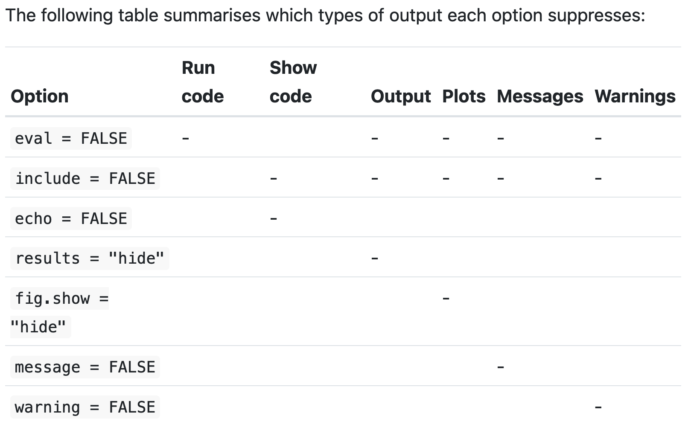

Use the RMarkdown cheatsheet and RMarkdown reference at:
Help -> Cheatsheets or at
[](https://rstudio.com/resources/cheatsheets/)

The header at the top of this file is YAML. It is surrounded by ---.

Chunks of code are surrounded by ```.

When you knit the document, this is how the final output is created:
Rmd file -> Knitr -> md file -> pandoc -> final output file

Difference between R markdown files and R notebooks:

 | Feature  |  R Markdown  | R Notebook
-| -------- |  ----------  | ----------
1. | YAML header | output: html_document | output: html_notebook
2. | Output location | console | below code chunk, in notebook
3. | Knitr output formats | html, pdf, docx | html only

Everything in the book is about RMarkdown. Seems like R Notebooks are
not used often?

## 27.3 Text formatting with RMarkdown

*italic* or _italic_
**bold** or __bold__
superscript^2^
subscript~2~

> blockquote

Horizontal rule:

***

Equations are inside $equation latex here$ inline and
$$Equation block$$

Tables using:

Table Header  | Second Header
------------- | -------------
Table Cell    | Cell 2
Cell 3        | Cell 4

## 27.4 Code chunks

Procedure | Command
--------- | -------------
To create a code chunk | Cmd/Ctrl + Alt + i 
Run the chunk          | Cmd/Ctrl + Shift + Enter
To run the complete report | Cmd/Ctrl + Shift + K or rmarkdown::render("1-example.Rmd")

# 27.4.1 Chunk name

``` {r chunk_name}
```

Advantages of naming chunks:

  * Easily navigate to chunk using drop-down code navigator
  * Graphics produced by chunks will have useful names you can use elsewhere
  * You can setup networks of cached chunks to avoid re-performing expensive
    calculations on each run
  * One chunk name that is special: setup. That chunk for a notebook is run
    once automatically before anything else is run
    
### 27.4.2 Chunk options

Chunk output can be customized with chunk options.
[All chunk options](http://yihui.name/knitr/options/)

Chunk option | Result
------------ | ------
eval = FALSE | Code not run
include = FALSE | Runs code, but doesn't show code/results in final doc. Use this for setup code that should not clutter your report.
echo = FALSE | prevents code, but results show up in final output. For people reading the report who don't want to read code.
message = FALSE or warning = FALSE | prevents messages/warnings appearing in the final output
results = 'hide' | hides printed output
fig.show = 'hide' | hides plots
error = TRUE | code continues to run even after an error



### 27.4.3 Table

By default, R markdown prints table output as in the console.
To get more formatting for tables, use knitr::kable
```{r}
mtcars[1:5, ]
```
```{r}
knitr::kable(mtcars[1:5, ], caption = "A knitr kable")
```

Read ?knitr::kable for more documentation. For even more formatting,
consider the xtable, stargazer, pander, tables, and ascii packages.

### 27.4.4 Caching

